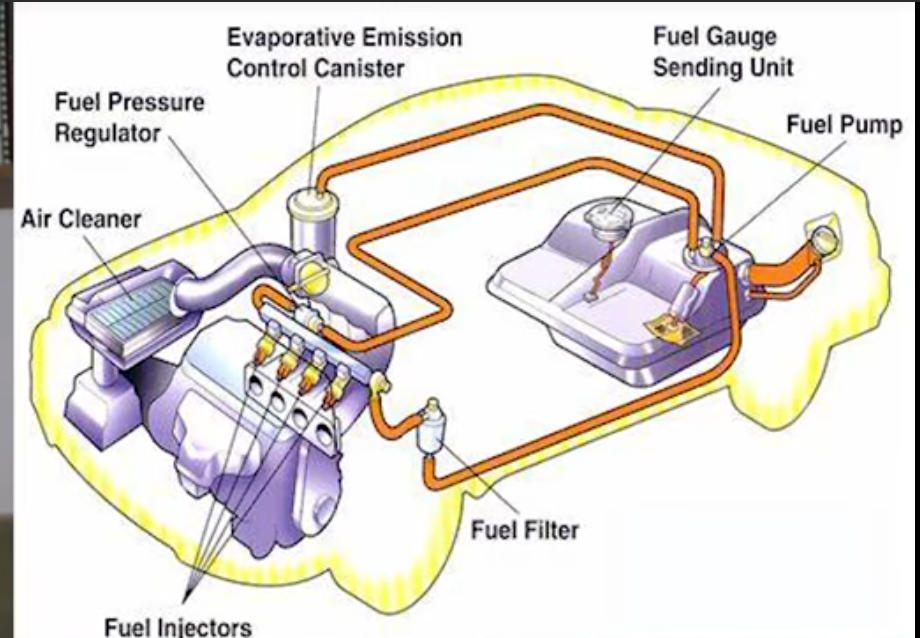

## Car Engine Notes

### Direct Injection (GDI)
<iframe width="560" height="315" src="https://www.youtube.com/embed/xrLNDgrIw3U" frameborder="0" allow="accelerometer; autoplay; encrypted-media; gyroscope; picture-in-picture" allowfullscreen></iframe>

### Engine Specs 
- [Honda Pilot 2018](img/honda-pilot-2018.pdf )
- [Honda Odyssey 2019](img/honda-odyssey-2019.pdf)

### How to fix a distributor on a Toyota engine

<iframe width="560" height="315" src="https://www.youtube.com/embed/nQv7edB35js" frameborder="0" allow="accelerometer; autoplay; encrypted-media; gyroscope; picture-in-picture" allowfullscreen></iframe>

 

#### Ethenol in gasoline

<iframe width="560" height="315" src="https://www.youtube.com/embed/lYugCF6Kmjk" frameborder="0" allow="accelerometer; autoplay; encrypted-media; gyroscope; picture-in-picture" allowfullscreen></iframe>

