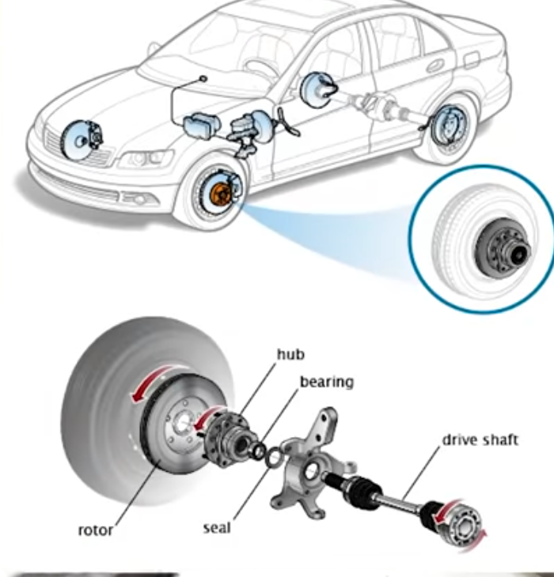
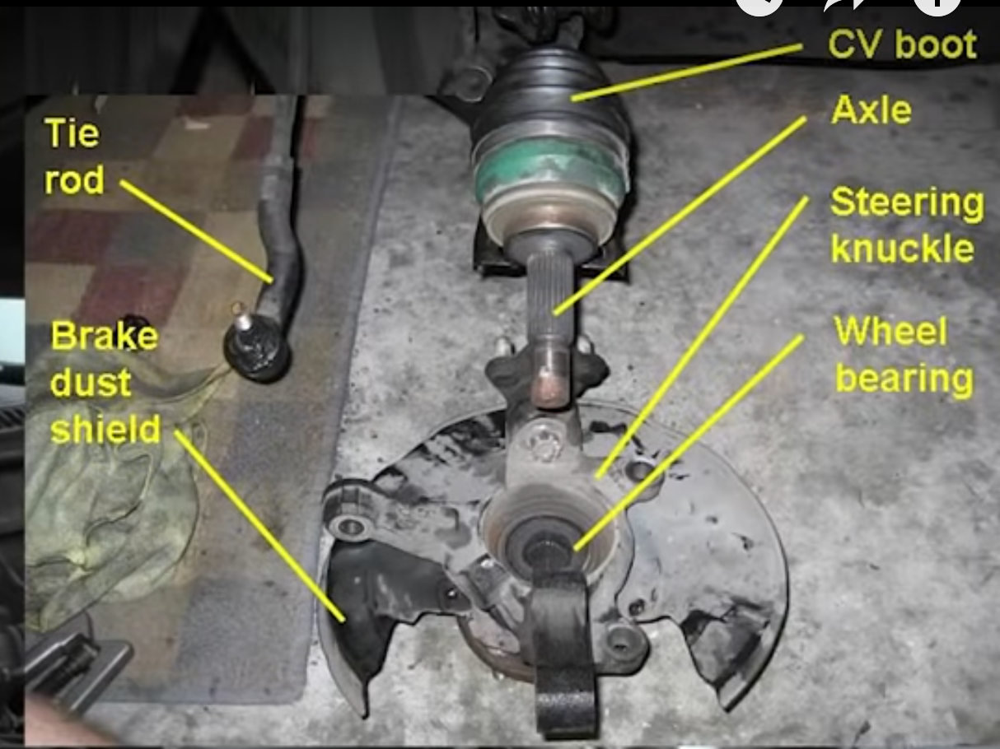
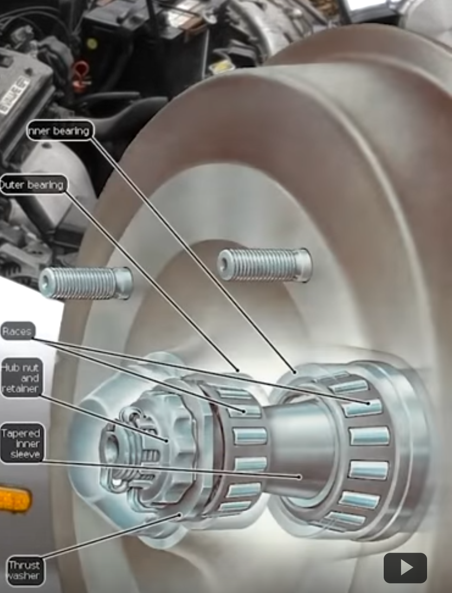
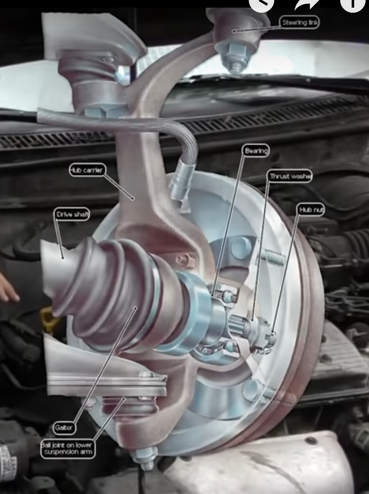
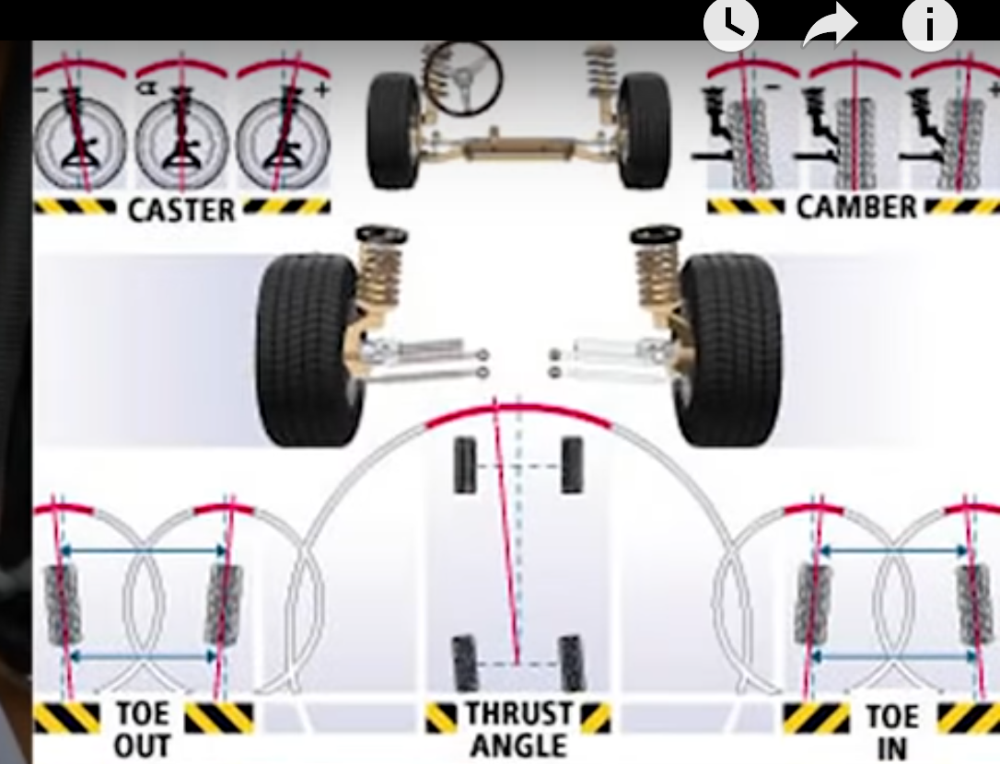
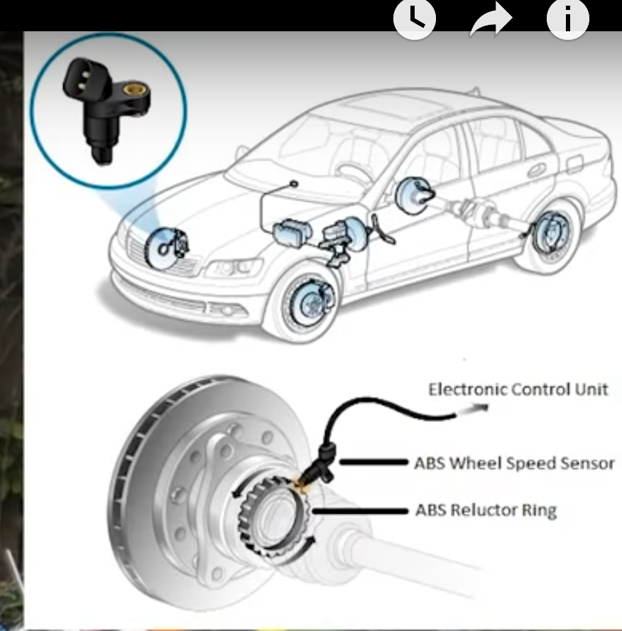

## Wheels

### Wheel Bearings

 

 

 

<iframe width="800" height="600" src="https://www.youtube.com/embed/V0tsauDGB0I" frameborder="0" allow="accelerometer; autoplay; encrypted-media; gyroscope; picture-in-picture" allowfullscreen></iframe>

### Wheel torque

[Wheel torque](https://www.discounttiredirect.com/learn/wheel-torque#honda)