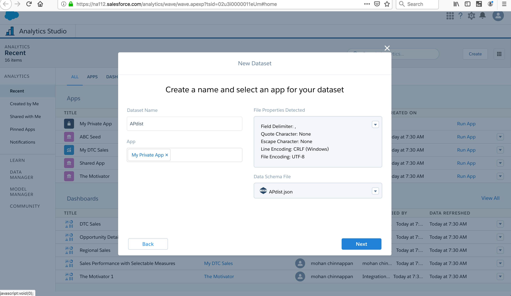
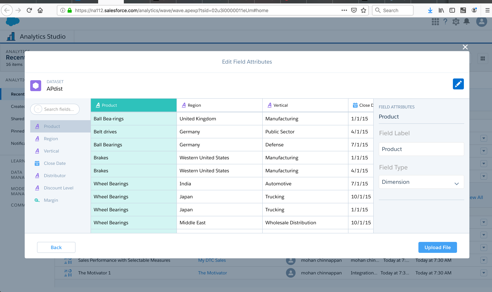
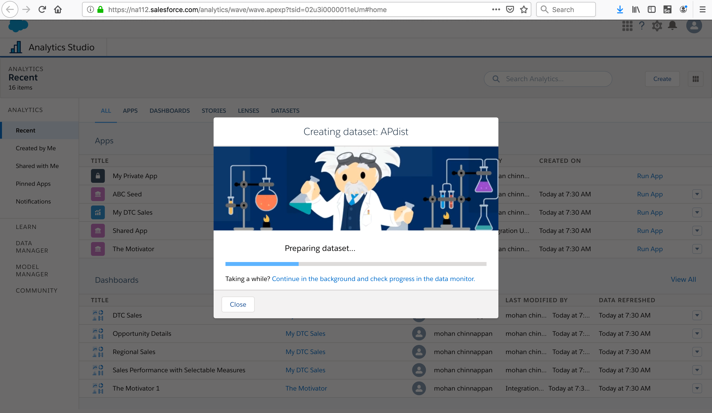
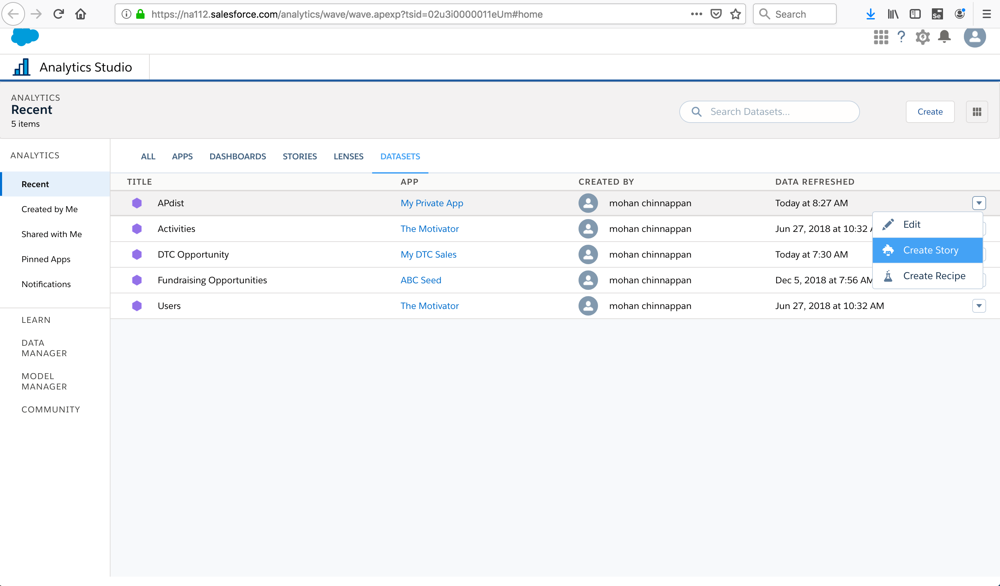
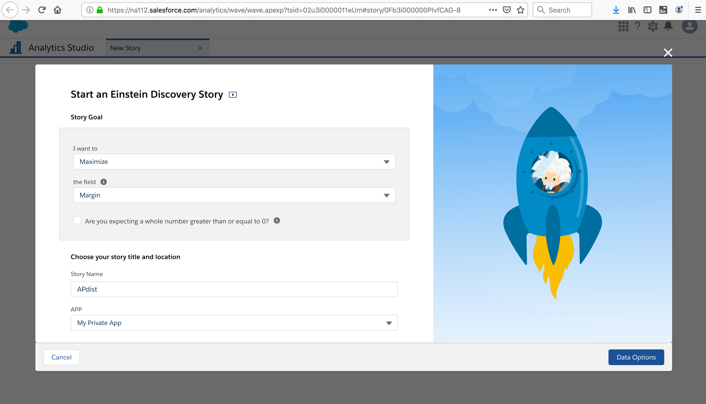
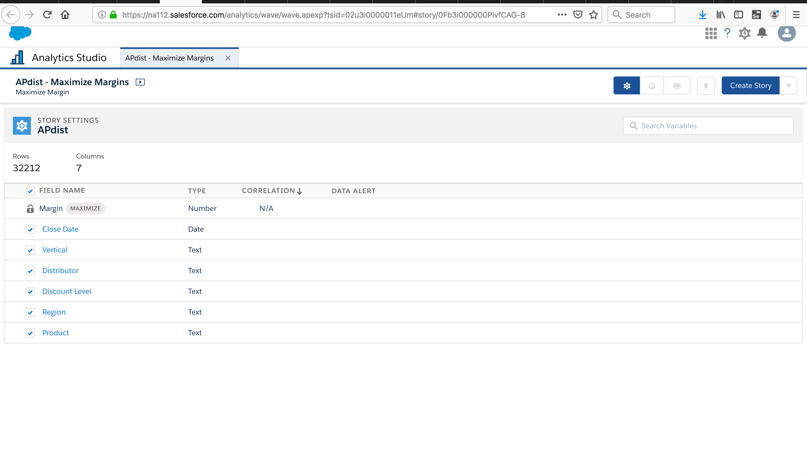
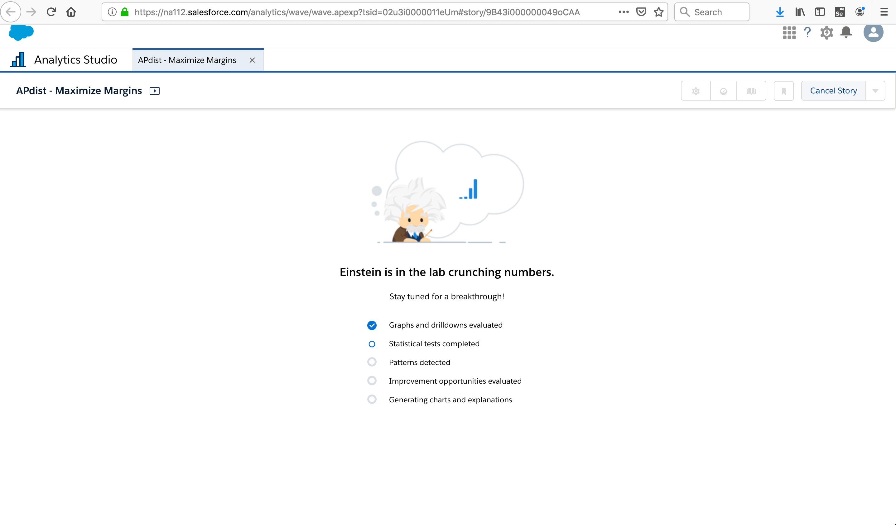
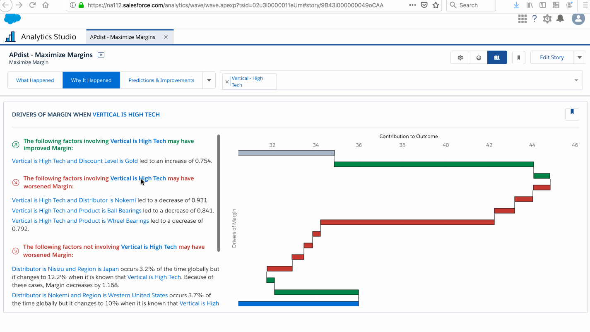
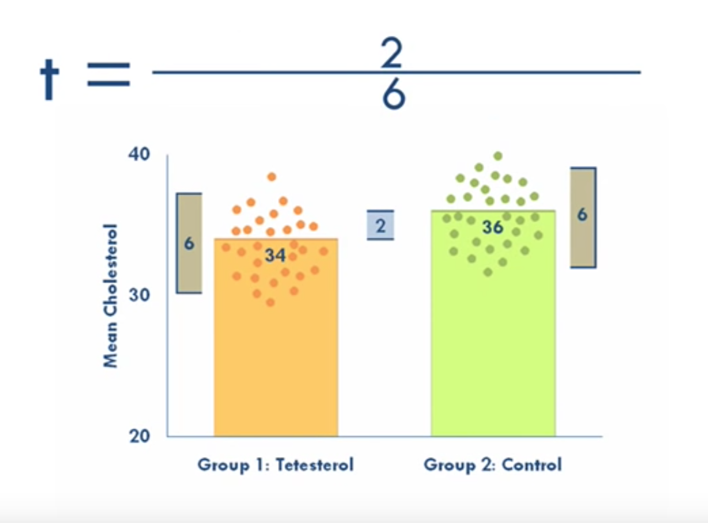
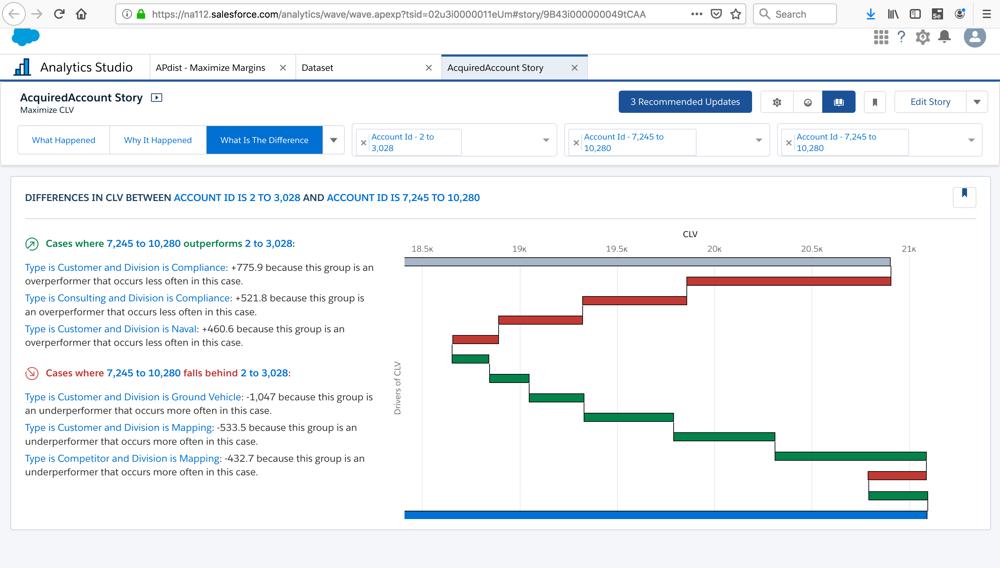

## EA discovery
- Using Einstein Discovery is like having a personal data scientist doing the heavy lifting to speed up your work.
- Every dataset tells a story. But it’s difficult to excavate that story when you’re dealing with **enormous tables of data and many variables with complex relationships**.
    - Example:   shrinking margins in an auto parts supply company. 
        - To do a thorough analysis, you need to consider not just inventory, but also particular **markets, distributors, incentives, and likely many other factors**.
- analyzes huge amounts of data to expose correlations that we can investigate
- shows us where to look for solutions, and predicts what might happen based on these correlations.

### Videos

- [Einstein Analytics - Discovery](https://www.youtube.com/watch?v=Ev895wkofX4)
- [Trailhead](https://trailhead.salesforce.com/en/content/learn/modules/wave_exploration_smart_data_discovery_basics/wave_smart_data_discovery_your_data_scientist)
- [Overview](https://www.salesforce.com/products/einstein-analytics/overview/)
- [EA Dev org](https://developer.salesforce.com/promotions/orgs/analytics-de)
- [EA Discovery Stories](https://trailhead.salesforce.com/en/content/learn/modules/understand_einstein_discovery_stories/use_stories)

### Key points

- quickly sift through huge amounts of data (EA dataset) to find:
    -  the important correlations 
    -  make accurate predictions
-  generates answers, explanations, and recommendations in a way that is easy for business users to understand

- finds the patterns
    - What was significant or unusual?
    - Why did it happen? What are the factors that possibly contributed to the observed outcome?
    - How do some factors compare with other factors?
    - What might happen in the future, based on a **statistical analysis** of the data?
        - Is there a trend, or does this data represent an isolated one-off incident?
    - Actions
        - What are some possible actions that could improve the outcome?

### Example
- what’s driving profitability by figuring out ways in which we can improve margin

- Use case:
    - The company’s CFO started it to find out why, all of a sudden, company margins are headed south. Then the CEO chimes in: “We must solve this issue immediately!”
    - input: transactions across different regions and verticals

- How to:
     - open up Analytics Studio, grab the Einstein Analytics dataset that contains the relevant data
     - tell it the variable (business metric) you want to learn about.
     - Minutes later, you get a story:
        - represents a comprehensive **statistical analysis** of your dataset.
        - provides insights about your data that pertain to the outcome variable you're interested in (margin)
        - possible underlying causes and relationships among possible influencers
        - anticipates what to expect next based on a predictive analysis of your dataset
        - suggests ways in which you might improve the outcome.
        - 

### Steps
- In EA, Create > Dataset

- What Happened to Our Margins?

- Create Story for the dataset APDist

- Based on the data in your dataset, Einstein Discovery suggests creating a story to “Maximize the variable Margin.” 

-  How do I maximize margins? And that question lines up with the most pressing question you have: What happened to lower our margins?

- Click [Data Options]. In the next screen, you tell Einstein which fields to use to create the story.

- You can de-select fields that you don't want used in the story. In this case, you want to use every field, so leave this page as it is.

### Results

### Get the Big Picture from Stories

- AcquiredAccount.csv  has  11 columns: Account Id, BillingState, Division, Industry, Ownership, Rating, Type, AccountScore, StartDate, CloseDate, and CLV(Customer lifetime value). The CSV file contains one row of information for each of the 10,000 different companies that our auto parts manufacturing company does business with. Here is what the first few rows of the CSV file look like:

- Customer lifetime value (CLV) is a metric that predicts the profitability over the entire lifetime of the company’s relationship with a customer.
- CLV helps to  find the group of customers who are potentially the most profitable. That way, more marketing resources can be allocated to them.

- Goals: maximizing margin or minimizing cost
- Result: answers, explanations, and recommendations arranged into an organized presentation with a logical flow and related sections
- Provides insights about your data and the variables you're interested in

##### What Happened - insights
- descriptive insights that tell you more about what happened according to the data in the dataset.

- explains statistically, the most variation in the outcome variable. 
-  uses bar charts to help you visualize What Happened insights.

- CLV is the outcome variable in your story, and maximizing CLV is your goal. 

- All the insights in this story show you how **different variables and combinations of variables** explain variations in CLV. 

-  The top insights in the list reflect the most statistically significant variations in the outcome variable.

- T-Test:
    - For each category in the Einstein Analytics dataset, Einstein Discovery performs a statistical calculation called a t-test to find out whether the category is **statistically significant**.
    - The t-test helps to identify categories that exhibit patterns that are statistically different from the other categories. 
    - For example, for the category called Naval, the first step is to split the data into two groups: **Naval and not Naval**. The second step is to use the t-test to determine whether these two groups are statistically different.

    - What is t-test? 
        - invented by William Sealy Gosset
        - [paper](img/probable-error-of-a-mean.pdf)
        -   checks if 2 means (averages) are reliably different from each other
        - it is an inferential statistics (instead descriptive statistics)
            - Not only describe our sample but also tell us about new samples that we do not have even
            - So allow us to take inferences (generalize the findings ) about whole population beyond our data we have
            - t = (variance between groups) / (variance within the group)
                - big t value : different groups
                - small t value :   similar groups
            
            - refer [StatsCast: What is a t-test?](https://www.youtube.com/watch?v=0Pd3dc1GcHc)
            - refer[Student's t-test](https://www.youtube.com/watch?v=pTmLQvMM-1M)
            - refer[T-test using Python and Numpy](https://towardsdatascience.com/inferential-statistics-series-t-test-using-numpy-2718f8f9bf2f)
    - Division is the variable that explains the most variation in CLV. 
    - This type of insight, called a **first-order analysis**, examines how one variable (Division) explains variation in the outcome variable (CLV).

    - The key takeaway from this insight is that Division explains 14.2% of the variation in CLV. Einstein Discovery did a statistical calculation to find the coefficient of determination, R2 (R squared). R2 tells you how much Division explains variation of the outcome variable (CLV)—in other words, how much predictive power the Division variable has. More observations describe other factors that affect CLV.

- CLV is the vertical axis and Division is the horizontal axis.
The orange horizontal line in the chart shows the average CLV, which is just above 20 K.
- Blue bars show variables that extend further above and below the average CLV—the most interesting correlations. Of these divisions, Raw Materials and Mapping are the most significantly above average, and Standard Hardware is the most significantly below average.
- Gray bars show variables that are close to the average CLV. These divisions are statistically less significant and, therefore, are not listed in the explanatory text on the left. When considering gray bars, you can't assume that the differences from the other categories is meaningful.

- In the blue curve, notice that more of the values are closer to the average. It has a smaller standard deviation. In the yellow curve, the values are more spread out, and therefore it has a larger standard deviation.

 

#### View a Second-Order Analysis

- This is a refinement of the first insight discussed previously, CLV by Division. It adds a second variable, When Type is Consulting, meaning that the combination of the two variables (CLV is Division and Type is Consulting) gives a strong signal. 

- Notice that what stands out first in the chart is the blue bar above Naval, which shows that Consulting is highest when Division is Naval.

- There are two bars for each division. The bar on the left represents the division's average value when only the retail industry is included. The bar on the right represents the average value for the division when all industries except retail are included. Comparing these bars lets you see how differently this pairing behaves.

- The reason that Einstein Discovery flags this insight is that this particular industry, Retail, behaves differently from the rest of the population, with regard to Division. In this case, each bar refers to a Division when Industry is Retail. When we compare each division against the rest of the population, we compare that division in the retail industry versus that division in all other industries. If those two groups are statistically different, the bar is highlighted in blue.

- 2,450: that is the difference between Standard Hardware when Industry is Retail and Standard Hardware in all other industries.

#### CLV by type

### What Is The Difference insights 

- are comparative insights that help you better understand the relationships between explanatory variables and the goal (target outcome variable) in your story.

- help you figure out which factors contribute to the biggest changes in the outcome variable. 

- It is useful to compare the CLV of a single variable with the global CLV average. 

- Compare Two Variables

- Add a Filter

Optionally, you can add a filter to further focus your analysis on a subset of the data. On the far right side of the Insights navigation bar, click Search story insights and choose Type - Consulting.

