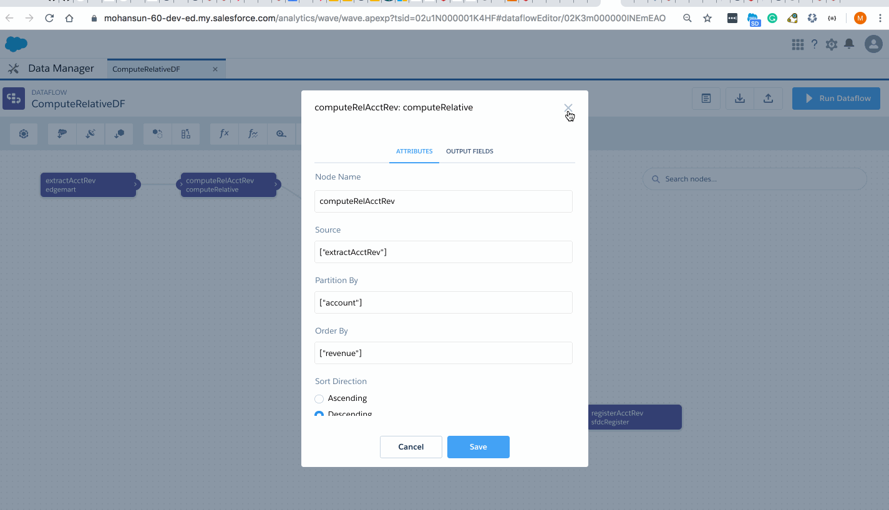

## Compute Relative
 - can do calculations with respect different rows (offset):
    - current()
    - first()
    - next()
    - previous()

```
( current(Amount) - previous(Amount) ) / previous(Amount)*100


case when previous(revenue) is null then current(revenue)
else previous(rollingSum) + current(revenue)
end

case when current(Amount) > previous(Amount) then \"Up\" 
     when current(Amount) < previous(Amount) then \"Down\" 
else \"No Change\" 
end

      
```

### Partitioned by: Account
<table border="1">
    <tr>
        <th>Account</th>
        <th>Revenue</th>
        <th>Rolling sum within Account Group`</th>
    </tr>
    <tr>
        <th>Acme Corp</th>
        <th>2000</th>
        <th>2000</th>
    </tr>
        <tr>
        <th>Acme Corp</th>
        <th>7000</th>
        <th>9000</th>
    </tr>
    <tr>
        <th>ABC Corp</th>
        <th>7000</th>
        <th>7000</th>
    </tr>
       <tr>
        <th>ABC Corp</th>
        <th>1000</th>
        <th>8000</th>
    </tr>
    <tr>
        <th>XYZ Corp</th>
        <th>1000</th>
        <th>1000</th>
    </tr>


</table>




```

{action: "query", responseId: "4QzCh1zGNYCAWVF8RyRzN-",…}
action: "query"
query: "q = load "0Fb3m0000000PmfCAE/0Fc3m000002c6vdCAA"; q = foreach q generate 'account' as 'account', 'revenue' as 'revenue', 'rollingSum' as 'rollingSum'; q = limit q 100;"
responseId: "4QzCh1zGNYCAWVF8RyRzN-"
responseTime: 3
results: {metadata: [{lineage: {type: "foreach",…}}],…}
metadata: [{lineage: {type: "foreach",…}}]
0: {lineage: {type: "foreach",…}}
lineage: {type: "foreach",…}
projections: [{field: {id: "q.account", type: "string"}, inputs: [{id: "q.account"}]},…]
0: {field: {id: "q.account", type: "string"}, inputs: [{id: "q.account"}]}
1: {field: {id: "q.revenue", type: "numeric"}, inputs: [{id: "q.revenue"}]}
2: {field: {id: "q.rollingSum", type: "numeric"}, inputs: [{id: "q.rollingSum"}]}
type: "foreach"
records: [{account: "Acme Corp", revenue: 2000, rollingSum: 9000},…]
0: {account: "Acme Corp", revenue: 2000, rollingSum: 9000}
1: {account: "Acme Corp", revenue: 7000, rollingSum: 7000}
account: "Acme Corp"
revenue: 7000
rollingSum: 7000
2: {account: "ABC Corp", revenue: 7000, rollingSum: 7000}
3: {account: "ABC Corp", revenue: 1000, rollingSum: 8000}
4: {account: "XYZ Corp", revenue: 1000, rollingSum: 1000}

```


## Compute Expression
    - can do calculations on the same row