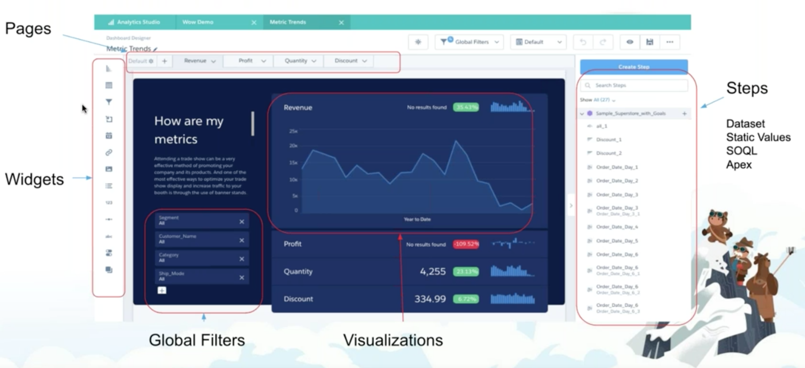

## Dataset

- Read-Only Data repository (storage) similar to file storage but proprietary format (key-value pair) and algorithms flattening the data with inverted indexes (for volume and speed)

- has following files
    - Dimension files (.dat)
        - has inverted index 
        - in a dimension, dimension values points to one or more records
        - used in the filters, example:  ```q = filter q by 'Stage' == "Closed Won"; ```

        - Dates
            - Decomposed into Dimensions
                - date parts
                - epochs (measures)
    - Measure files (.mea)
        - scalar 
        - not indexed
    - inverted index file (.idx) - for dimension indexing
    - json files (.json) for metadata and formatting info

 <table border='1'>
<caption>Inverted  Index - Dimensions - Good in filtering
</caption>
<tbody><tr>
<th>key</th>
<th>value (pointers to records)</th>
</tr>
<tr> <td>OpptyName: 100 Solar Panels</td> <td>17,10,20 </td></tr>
<tr> <td>AccountName: Acme Corp</td> <td>99,72 </td></tr>
<tr> <td>ContactName: Dennis Ritchie</td> <td>88,22 </td></tr>
</tbody></table> 


- Measure are represented as scalars

<table border='1'>
<caption>Scalar for measure - per row
</caption>
<tbody><tr>
<th>Amount</th>
</tr>
<tr><td>1000</td></tr>
<tr><td>8000</td></tr>
<tr><td>12000</td></tr>

</tbody></table>


### Forward index

- stores a list of words for each document
<table border='1'>
<caption>Forward Index
</caption>
<tbody><tr>
<th>Document</th>
<th>Words
</th></tr>
<tr>
<td>Document 1</td>
<td>the,cow,says,moo
</td></tr>
<tr>
<td>Document 2</td>
<td>the,cat,and,the,hat
</td></tr>
<tr>
<td>Document 3</td>
<td>the,dish,ran,away,with,the,spoon
</td></tr></tbody></table>

### Inverted index

- stores a mapping from content, such as words or numbers, to its locations in a table
  <table border='1'>
  <caption>Inverted index
  </caption>
  <tbody><tr>
  <th>Word</th>
  <th>Documents
  </th></tr>
  <tr>
  <td>the</td>
  <td>Document 1, Document 3, Document 4, Document 5, Document 7
  </td></tr>
  <tr>
  <td>cow</td>
  <td>Document 2, Document 3, Document 4
  </td></tr>
  <tr>
  <td>says</td>
  <td>Document 5
  </td></tr>
  <tr>
  <td>moo</td>
  <td>Document 7
  </td></tr></tbody></table>


  ### Runtime

  - Dimensions and measures are loaded into memory from the initial query
  - Cached and available for subsequent queries from any user (warming the cache)
  - lazy load
    - only loads dimensions and measures applicable for the query in execution


### Best Practices

- Avoid using lots of discrete entities as datasets
- Instead augment, widen to encapsulate dimensions for various entities (wider and de-normalized dataset)
    - This will reduce the query complexity
    - But only add the dimensions and measures only needed
    - Improve query performance
    - Easy maintenance of queries and dashboards


### Dashboard


