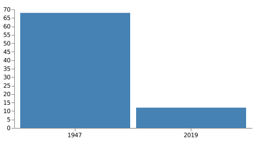

# Top 10 items India should do to become a great Farming Nation

## Executive Summary

India is a country of farmers. Indian economy is an agrarian economy. Indian agricultural production for food staples is monsoon dependent. Farm yields are generally below the world average. Currently the total imports is around 50 billion USD. GDP contribution of Agriculture is currently at 12%. It dropped from 68% in 1947, a net drop of 56% in 72 years. This is mainly due to lack of focus in development of infrastructure for agriculture and improper implementation of
[Green Revolution](https://en.wikipedia.org/wiki/Green_Revolution_in_India).

 Green Revolution introduced high-yielding varieties(HYV) seeds and associated fertilizers. While Green revolution started with a goal to meet growing food demands, it was not carried out in a systematic way to preserve the fertility of the farm land. Due to heavy use of fertilizers needed by the HYV seeds, farming land lost its fertility and finally reached a state of no-return. This made farming an unsustainable to most of the Indian farmers. This resulted in exodus of farmers. India needs to get back to basics of [Organic Farming](https://en.wikipedia.org/wiki/Organic_farming) as proposed and implemented by [G.Nammalvar](https://en.wikipedia.org/wiki/G._Nammalvar) and [Subhash Palekar](https://en.wikipedia.org/wiki/Subhash_Palekar). In this book we try to propose top 10 things India should do to get back a real agrarian economy with agriculture GDP contribution more than 70%.

## Top 10 items India should do 

1. [Water Resource Management](./water_mgmt.html)
2. Select right [trees](./key_trees.md) to grow and grow them in billions as crazy!
3. Become a leader in Agriculture equipment manufacturer in the world
4. [Organic way of farming]((https://en.wikipedia.org/wiki/Organic_farming)) with help of native seeds, native Cows, Goats, Donkeys and others
5. Create a market place for the farmers of India and other countries
6. World wide farmer collaboration with real-time analytics to know the heart-beat of the farmers
7. Employ Machine Learning (ML) and Deep Learning (DL) in Agriculture to help the farmers
8. Educate each student about agriculture (compulsory subject) and provide them with agricultural hands-on trainings
9. Zero budget farming
10. Create food-forests and preserve the birds, animals and other entities

### References
1. [India - Agricultural Sector](https://www.export.gov/article?id=India-Agricultural-Sector)
