## Water Resource Management

- Proper Water Resource Management is the key
- Water stored under the soil is only for the plants
    - Entities living above the soil including human, birds, animals,.. should not have access to the under-the-soil water
    - Obtaining water from drilling the land will reduce the water level to level where plants can't reach and result in death of those plants. This will result in deserts!

- Stop importing [petroleum](https://en.wikipedia.org/wiki/Petroleum) oil 
    - Produce [Ethanol](https://en.wikipedia.org/wiki/Ethanol) from [Corn](https://en.wikipedia.org/wiki/Corn_ethanol) and [Sugarcane](https://sugarcane.org/ethanol/)
    - Use [E85](https://en.wikipedia.org/wiki/E85) as the prime fuel
- Start sharing water with every farmer, so each one can contribute to the development of Ethanol and all required corps
- Stop wasting water into the Seas
- Avoid Flood Irrigation : Drip Irrigation can double/triple the yield

- Collaborate with other Countries/Universities to move forward

- Farming contribution to GDP ([Gross Domestic Product](https://en.wikipedia.org/wiki/Gross_domestic_product)) should be increased to more than 70% (2019 value: 12%, it was 68% in 1947, world average: 6.4%)
- Stop importing vegetable oils like [Palm oil](https://en.wikipedia.org/wiki/Palm_oil) 
    - Encourage the use of by local cultivation of the seeds and nuts required:
        - [Coconut-nut oil](https://en.wikipedia.org/wiki/Coconut_oil)
        - [Mustard oil](https://en.wikipedia.org/wiki/Mustard_oil)
        - [Sesame seed oil](https://en.wikipedia.org/wiki/Sesame_oil)
        - [Peanut oil](https://en.wikipedia.org/wiki/Peanut_oil)
        - [Castor oil](https://en.wikipedia.org/wiki/Castor_oil)
        - [Sunflower oil](https://en.wikipedia.org/wiki/Sunflower_oil)
        - [Grape seed oil](https://en.wikipedia.org/wiki/Grape_seed_oil)
        - [Olive oil](https://en.wikipedia.org/wiki/Olive_oil)
        - [Linseed oil](https://en.wikipedia.org/wiki/Linseed_oil)

### Speech by Mr. Nallaswamy about Water Resource Management in Tamil covering above points
<video controls width="800" height="600"  >
                      <source src="https://mohan-chinnappan-n2.github.io/2019/farming/img/farming-water-mgmt.mp4" type="video/mp4">
                      Your browser does not support the video tag.
</video>

### Remember Gandhi!

Gandhi wanted to have an ideal society of his own imagination and his economic ideas are a part and parcel of his philosophical and sociological ideas. Gandhi is in favor of the **self-sufficient village economy** where the villages will be the independent economic units.

### Learn from Israel's Agriculture and Water Management

 - only 20% of the land is arable (suitable for growing crops)
 - multiplied crop production by 16x from 1948 
 - has close cooperation between:
    - farmers
    - agro industry
    - technological research (17% of total agriculture budget)
- self-sufficient (90%) with respects vegetables, fruits (other than tropical fruits: jackfruit, coconut)

#### Milestones
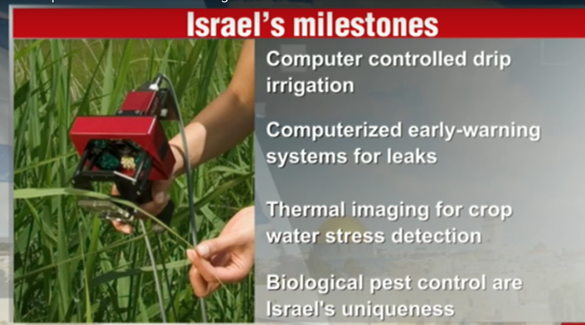

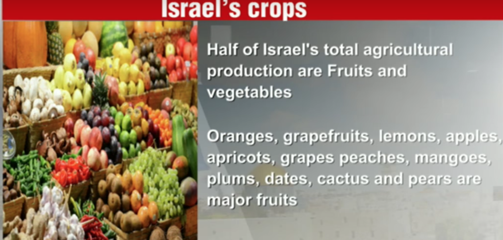
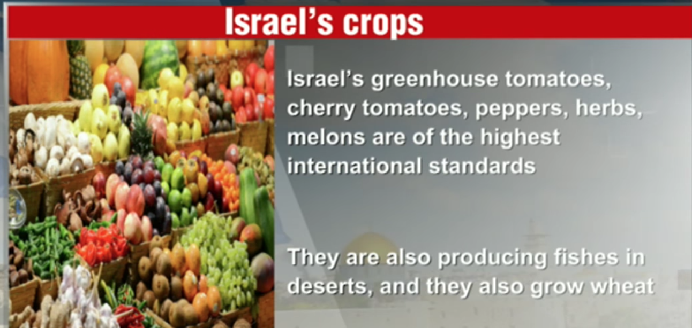

### Mandarin growing - Intensive growing
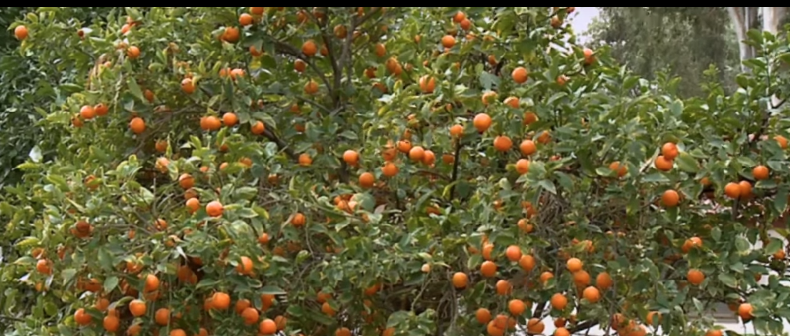

#### Live stock - High yielding disease resisting cows
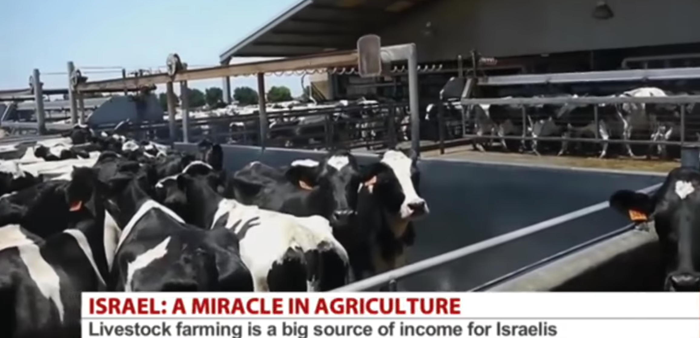

#### Modern irrigation

- drip irrigation

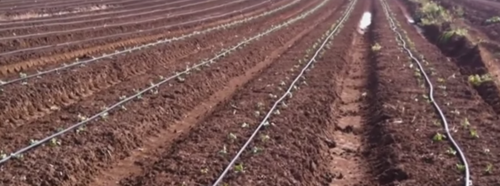

- jet irrigation
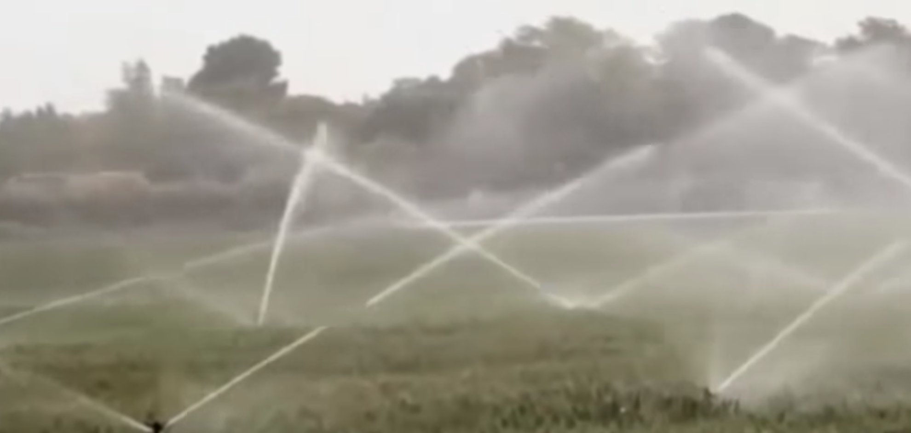

- mobile sprinkler irrigation
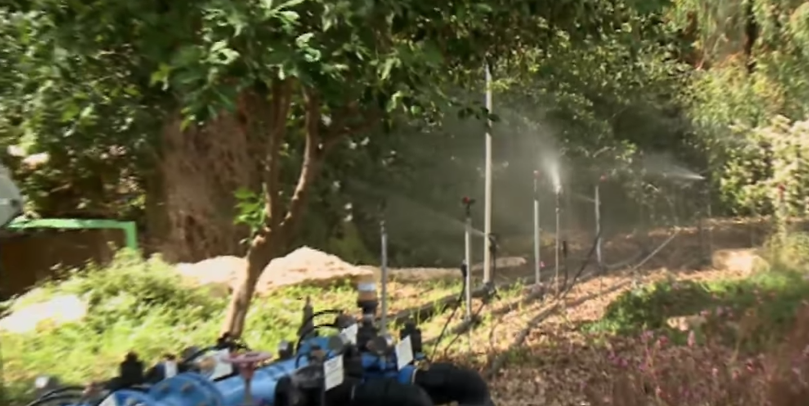

- spraying 
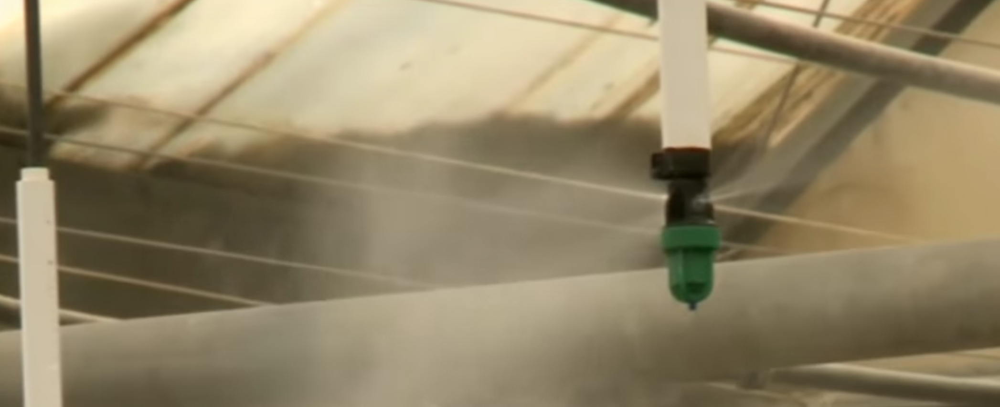

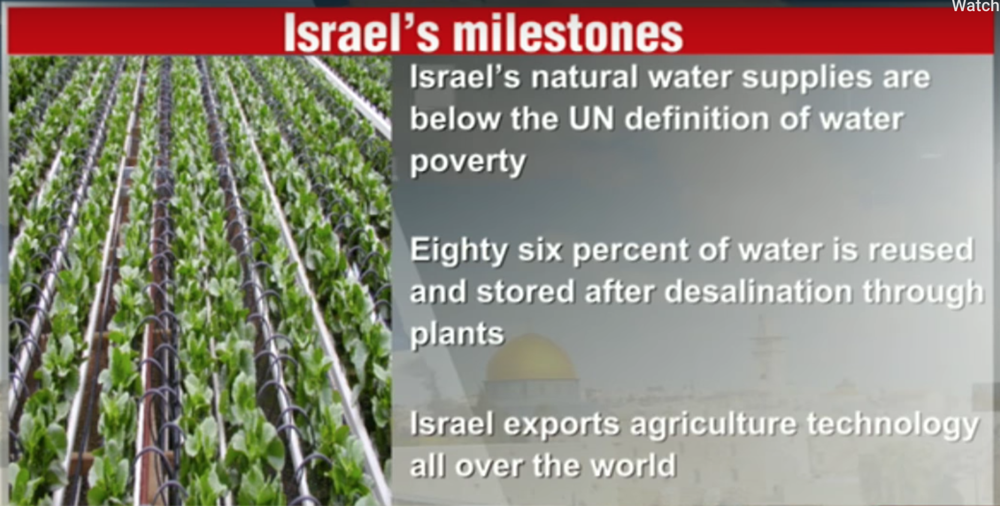

- farm equipment made locally
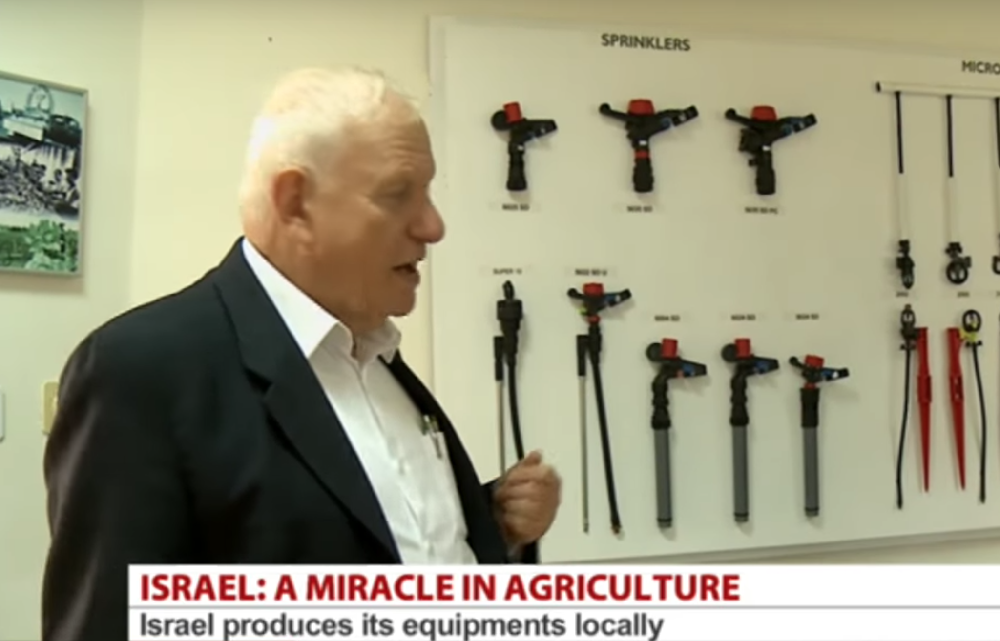
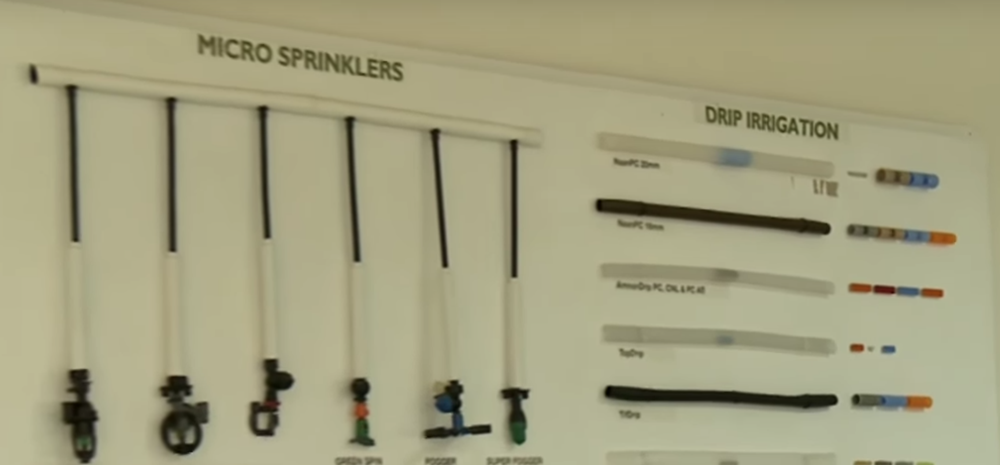

-  Jews were not trained to be farmers but in Israel they made agriculture as the prime culture and industry with 9M population!

- exports fresh produce and agriculture machineries to the world

- water conservation is employed - plants are grown in tunnels of white plastic sheets with vent holes

- hiring labors from Thailand for the farm work. Thai labors go back to Thailand they implement these technique in their homeland

- cactus cultivation in large scale for leaves and fruits

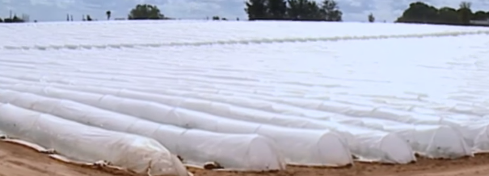
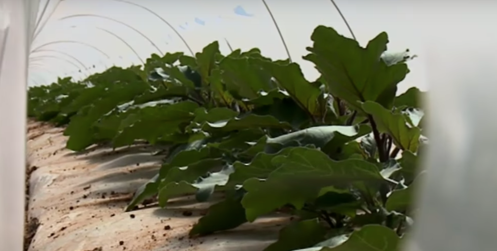

<iframe width="800" height="600" src="https://www.youtube.com/embed/LQ3192n9KVU" frameborder="0" allow="accelerometer; autoplay; encrypted-media; gyroscope; picture-in-picture" allowfullscreen></iframe>

