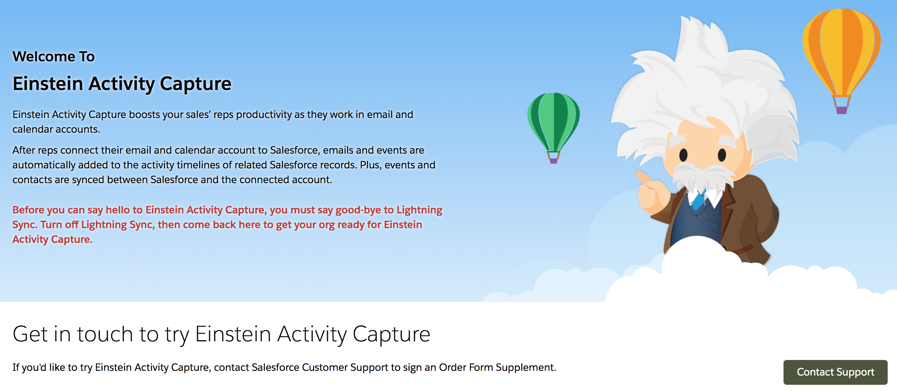

### Einstein Activity Capture
- [How Users Set Up Einstein Activity Capture ](https://www.youtube.com/watch?v=yVO9XnsW2vA)
- [Einstein Activity Capture](https://www.salesforce.com/content/dam/web/en_us/www/documents/datasheets/sales-cloud-einstein-activitycapture.pdf)
- [Set Up Einstein Activity Capture](https://help.salesforce.com/articleView?id=aac_configure.htm&type=5)
- [setup: Einstein Activity Capture](https://www.simplysfdc.com/2018/10/einstein-activity-capture.html)

### Lightning Sync 
Lightning Sync for Microsoft Exchange can sync contacts and events between your Microsoft Exchange-based calendar and Salesforce.
- [Ref](https://help.salesforce.com/articleView?id=lightning_sync_admin_overview.htm&type=5)
- [Set Up a Microsoft Exchange Service Account to Sync with Salesforce (Office 365 Admin Center)](https://www.youtube.com/watch?v=pVD4gye3ujE)
- [FAQ - Lightning Sync](https://help.salesforce.com/articleView?id=000313684&type=1&mode=1)
- [See the Big Picture for Setting Up Lightning Sync for Microsoft® Exchange](https://help.salesforce.com/articleView?id=exchange_sync_admin_implement_ex_sync.htm&type=5)

