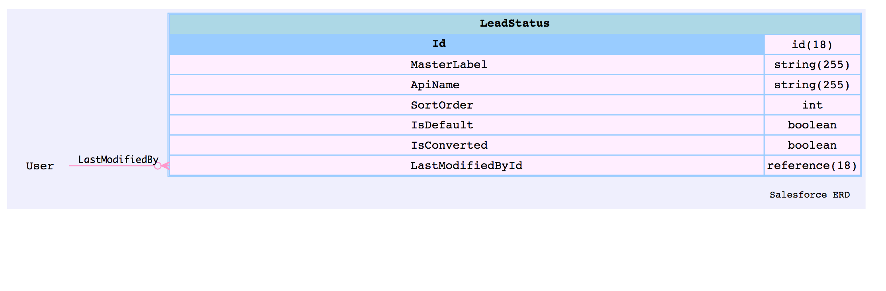
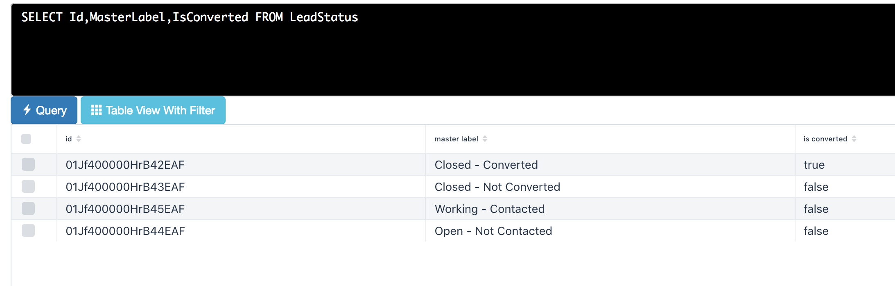

### Lead Conversion 

 - The *convertLead* Database method converts a lead into an account and contact, as well as (optionally) an opportunity. 
 - The *Database.convertLead()* method can take one LeadConvert object or a list of LeadConvert objects
 - Doc: [LeadConvert Class](https://developer.salesforce.com/docs/atlas.en-us.apexcode.meta/apexcode/apex_dml_convertLead.htm)


<a class='btn btn-success' target='_blank' href="https://mohan-chinnappan-n.github.io/sfdc/fs-cloud/csv-viewer.html?f=Lead">Lead Object</a>

```java

// create the lead 
Lead myLead = new Lead(LastName = 'Johnson', Company='Johnson And Sons');
insert myLead;

// get MasterLabel from LeadStatus for the isConverted=true
LeadStatus convertStatus = [SELECT Id, MasterLabel FROM LeadStatus WHERE IsConverted=true LIMIT 1];
lc.setConvertedStatus(convertStatus.MasterLabel);

// prepare the LeadConvert object 
Database.LeadConvert lc = new Database.LeadConvert();
lc.setLeadId(myLead.id); // set the id of the lead we just created

// here we are passing one LeadConvert object to Database.covertLead(...)
Database.LeadConvertResult lcr = Database.convertLead(lc);
System.assert(lcr.isSuccess());

```

### The convertLead method accepts up to 100  LeadConvert objects

```java

trigger LeadConversion on Lead (after update) {

   Integer LCLIMIT = 100; //The convertLead method accepts up to 100  LeadConvert objects
   List<Lead> LeadsToBeConverted = new List<Lead>();
   List<Database.LeadConvert> leadConverts = new List<Database.LeadConvert>();

   // get MasterLabel from LeadStatus for the isConverted=true
   LeadStatus convertStatus = [SELECT Id, MasterLabel FROM LeadStatus WHERE IsConverted=true LIMIT 1];

   // gather all the leads to be converted
   for(Lead ld: Trigger.new) {
        if(!lid.isConverted) LeadsToConvert.add(ld); // check is converted already
   }

   List<Database.LeadConvert> leadConverts = new List<Database.LeadConvert>();
   for(Lead ltc : LeadsToConvert) {
        Database.LeadConvert lc = new database.LeadConvert();
        // Set the ID of the lead to convert. This field is required.
        lc.setLeadId(ltc.Id);
        // Set the lead status value for a converted lead. This field is required.
        lc.setConvertedStatus(convertStatus.MasterLabel);
        // Specify whether to create an opportunity during lead conversion. The default value is false: opportunities 
        //   are created by default. 
        //  Set this flag to true only if you do not want to create an opportunity from the lead.
        lc.setDoNotCreateOpportunity(true);

        leadConverts.add(lc);
   }
   // we have leads to convert?
   if (!leadConverts.isEmpty()) {
       // ref: https://developer.salesforce.com/docs/atlas.en-us.apexcode.meta/apexcode/apex_methods_system_database.htm
       // The convertLead method accepts up to 100 (LCLIMIT) LeadConvert objects.
       //   Each executed convertLead method counts against the governor limit for DML statements.
       Integer lcsize = leadConverts.size() ; 
       Integer times =  lcsize / LCLIMIT ;
       for(Integer i = 0; i <=  times ; i++) {
            // compute start and end indexes
            Integer startNdx = i * LCLIMIT;
            Integer endNdx = ( (startNdx + LCLIMIT) < lcsize ) ? (start + LCLIMIT) : lcsize );
            
            // prepare the bucket (list) of 100 or less leads 
            List<Database.LeadConvert> curList = new List<Database.LeadConvert>();
            for(Integer j = startNdx; j< endNdx; j++) {
                curList.add(leadConverts[j]);
            }
            // Convert the list of LeadConvert objects (curList) into accounts and contacts, as well as (optionally) opportunities.

            // public static Database.LeadConvertResult[] convertLead(Database.LeadConvert[] leadsToConvert, Boolean allOrNone)
            //  The optional allOrNone parameter specifies whether the operation allows partial success
            // If you specify false for this parameter and a record fails, the remainder of the DML operation can still succeed. 
            //  This method returns a result object that can be used to verify which records succeeded, which failed, and why.
            //    If the parameter is not set or is set true, an exception is thrown if the method is not successful.
            Database.LeadConvertResult[] lcrResultList = Database.convertLead(curList, false);
            // the above result object (lcrResultList) that can be used to verify which records succeeded, which failed, and why. 
            // NOTE:
            // At the backend we optimize the convertLead processing of the items by running them in parallel and also bulkify as much as possible.
       }

   }
}
   


```




<hr/>


<a class='btn btn-success' target='_blank' href="https://mohan-chinnappan-n.github.io/sfdc/fs-cloud/csv-viewer.html?f=LeadStatus">LeadStatus Object</a>
<hr/>


