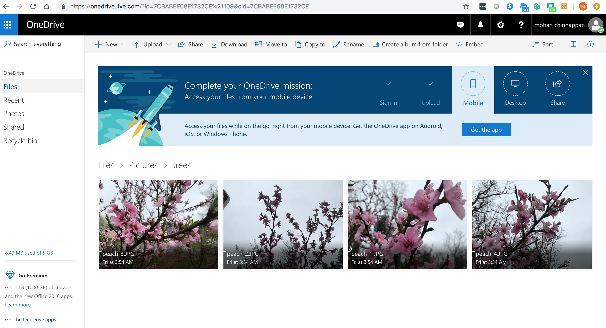

## MS Graph API

### Quick Start
[Quick Start](https://developer.microsoft.com/en-us/graph/quick-start)

- Provides App Secret
- App Id

### Getting Started with Microsoft Graph API

<iframe width="560" height="315" src="https://www.youtube.com/embed/PI9NO5rayiY" frameborder="0" allow="accelerometer; autoplay; encrypted-media; gyroscope; picture-in-picture" allowfullscreen></iframe>

### MS Graph Explorer
[Graph Explorer Online](https://developer.microsoft.com/en-us/graph/graph-explorer)

### My onedrive pictures

### Using Graph Explorer - Demo

### Getting Started with Microsoft Graph and Application Registration

<iframe width="560" height="315" src="https://www.youtube.com/embed/93j0MmRruFo" frameborder="0" allow="accelerometer; autoplay; encrypted-media; gyroscope; picture-in-picture" allowfullscreen></iframe>

###  Using a REST Client
[Using Postman to call the Microsoft Graph API using Authorization Code Flow
](https://blogs.msdn.microsoft.com/aaddevsup/2018/05/23/using-postman-to-call-the-microsoft-graph-api-using-authorization-code-flow/)

