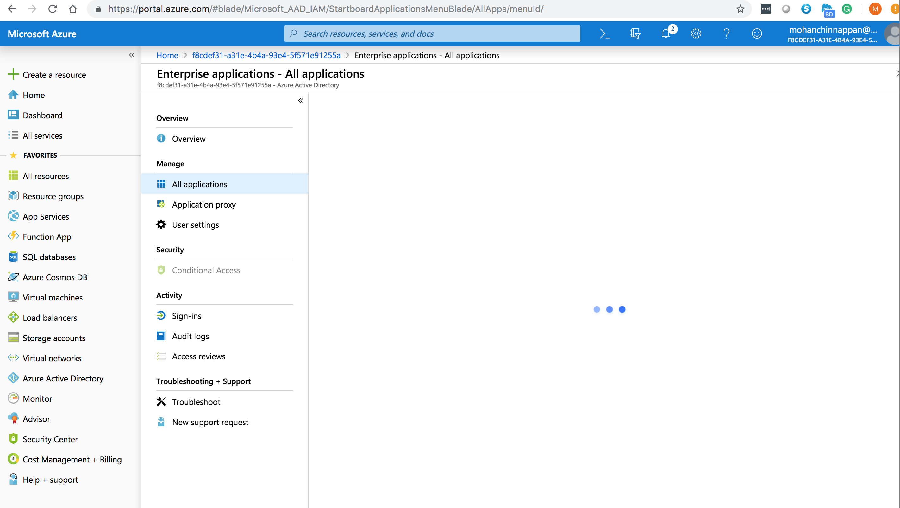

### Salesforce O365 integration notes

#### Videos
[Authenticate and connect with Microsoft Graph](https://www.youtube.com/watch?v=QZHNPr7TRPU)
[Get access without a user](https://docs.microsoft.com/en-us/graph/auth-v2-service)
[How to set up a multifunction device or application to send email using Office 365
](https://docs.microsoft.com/en-us/Exchange/mail-flow-best-practices/how-to-set-up-a-multifunction-device-or-application-to-send-email-using-office-3?redirectSourcePath=%252fen-us%252farticle%252fHow-to-set-up-a-multifunction-device-or-application-to-send-email-using-Office-365-69f58e99-c550-4274-ad18-c805d654b4c4)
[utorial: Azure Active Directory integration with Salesforce)(https://docs.microsoft.com/en-us/azure/active-directory/saas-apps/salesforce-tutorial)

### Azure Portal Access for the App galary

