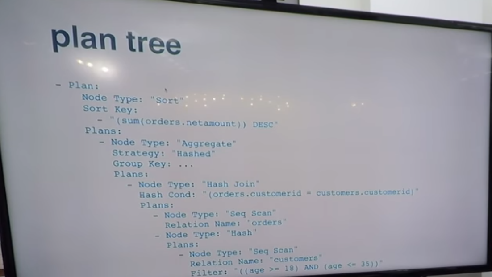

## PostgreSQL under the hood

```c
// psql

while (true) { // loop forever
    // get input by providing a prompt '=>' and user enters the query
    char *input = readline("=> ");
    if (strcmp(input, "\q") == 0 { // user wants to quit
        exit(0);
    }
    // execute the query 
    PGresult result = PQexec(conn, input);
    // print result
    

}

```

### What libs psql depends on? 

```bash
# libpq
$ otool -L  /Library/PostgreSQL/9.6/bin/psql 
/Library/PostgreSQL/9.6/bin/psql:
	@loader_path/../lib/libpq.5.dylib (compatibility version 5.0.0, current version 5.9.0)
	@loader_path/../lib/libedit.0.dylib (compatibility version 1.0.0, current version 1.53.0)
	/usr/lib/libSystem.B.dylib (compatibility version 1.0.0, current version 169.3.0)

```

### libpq

```
PGconn *conn = PQconnectdb(/* connection info here */); //PQ came from PostQL ( old query query lang of postgres)
PQexec();

//-------- PQexec is translated into
// fd is a socket()
write(fd, /* content to be written */);
read(fd, /* where to read into */)


```

### Frontend/Backend protocol

- [Doc](https://www.postgresql.org/docs/9.3/protocol.html)

- custom protocol to communicate between client (C) and server (S)

```
# format: network stream 
# C->S  <code> <msg_len> <msg> 
# <code>: Q | T | D | Z | X
  # query
  C->S  'Q'     200     "SELECT Id, Name From Person"
  # number of tuples (T descriptor: num_cols, col_types)
  S->C  'T'     100     "..."
  # now data rows
  S->C  'D'     2000    "data here ..."
  ...
  # End of query (Z)
  S->C  'Z'     10   "End-of-Query results"
  ... Next Query (Q)

  # Terminate (X)
  C->S  'X'  10


```

<table class='table table-bordered table-striped'>
 <tr> <th>Flow</th><th>Code</th><th>Msg Length</th><th>Msg</th></tr>
 <tr><td>C->S</td><td>Q</td><td>200</td><td>SELECT Id,Name FROM Person</td></tr>

 <tr><td>S->C</td><td>T</td><td>100</td><td>Number of cols, col types</td></tr>
 <tr><td>S->C</td><td>D</td><td>2000</td><td>Data row</td></tr>
 <tr><td>S->C</td><td>D</td><td>2000</td><td>Data row</td></tr>
 <tr><td>S->C</td><td>Q</td><td>200</td><td>End-of-query results</td></tr>

<tr><td>C->S</td><td>X</td><td>10</td><td>terminate</td></tr>


</table>

### Tools

- tcpdump
- WireShark
- Postgres doc


### Lexical analysis (yylex)

```bash
 "SELECT Id,Name FROM Person" -->

 SELECT

 ','
 ...


```

### yyparse

```c
  yyparse( yylex() ); // parse tree: in-mem rep of the query -- set of c structs

  List:
    - SelectStmt
        targetList:
            -ResTarget
            -ResTarget
        fromClause
            - JoinExpr
        whereClause
            ...
        groupClause
            ...
        sortClause
            - SortBy
            ...


```


### Parsing tools

- flex
- bison
- scan.l
- gram.y


### Parse analysis - Error checks done here

[src/backend/parser](https://github.com/postgres/postgres/tree/master/src/backend/parser)

```
 loc:  src/backend/parser/

```

- additional syntax analysis
- check tables,cols exist
- check the type matching
- system catalogs (pg_class, pg_type,...)
- results in the modified parse tree


```sql

 -- stmt:
 
  WHERE Customer.age BETWEEN 18 AND 35

 -- translated into
 SELECT oid  FROM pg_type WHERE typname = 'int2';

 SELECT oprcode FROM pg_operator
    WHERE oprname = '>=' AND oprleft = 18 AND opright = 35;

 SELECT prosrc FROM pg_proc WHERE proname = 'int2ge';

 -- int2ge 

 Datum int2ge(PG_FUNCTION_ARG) {
     int16  arg1 = PG_GETARG_INT16(0);
     int16  arg2 = PG_GETARG_INT16(2);

     PG_RETURN_BOOL(arg1 >= arg2);
 }

```

### Rewriting
[/src/backend/rewrite](https://github.com/postgres/postgres/tree/master/src/backend/rewrite)

 - kind of macro expansion (little buggy, not used much now)
 - expand views definition, rules
 - results in parse tree


### Planning/Optimizing
[/src/backend/optimizer](https://github.com/postgres/postgres/tree/master/src/backend/optimizer)

- parse tree --> execution plan (4 Generation lang basis)

- get stats about the tables (what [vacuum](https://www.postgresql.org/docs/9.1/sql-vacuum.html) and [analyze](https://www.postgresql.org/docs/9.1/sql-analyze.html) collect)




### Videos

<iframe width="560" height="315" src="https://www.youtube.com/embed/zkEhX0yOL3k" frameborder="0" allow="accelerometer; autoplay; encrypted-media; gyroscope; picture-in-picture" allowfullscreen></iframe>

