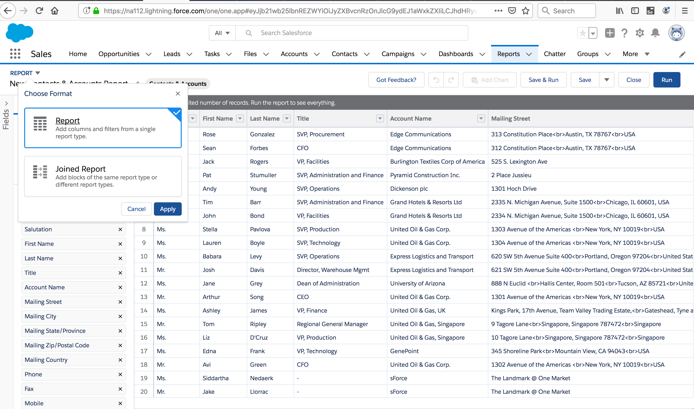
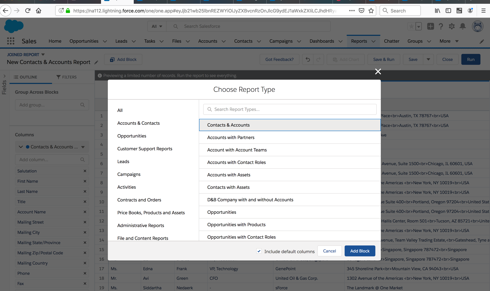
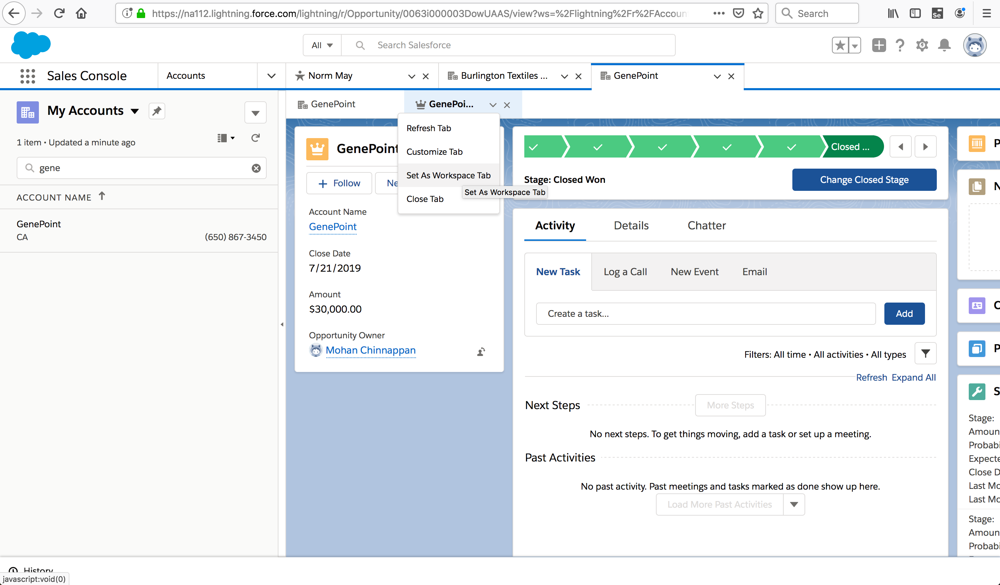

##  What’s New in Spring ’19

[What is new in spring 19](https://trailhead.salesforce.com/en/content/learn/modules/administrator-maintenance-spring19/learn-whats-new-in-spring19)

- Customize the full sales process, from the top of your funnel to closure
- Explain the features of Joined Reports in Lightning Experience.
- Remove an entire account team with a click
- Manage a workspace with new subtab options.
- Create sharing relationships between partner accounts and protect confidential data by sharing only select information

### Customize the full sales process, from the top of your funnel to closure
Salesforce Essentials recommends appropriate sales stages for businesses like yours. You can tailor **lead stages and opportunity stages** to your unique small business needs. 

Customize every stage of your sales process, from the top of your funnel with leads through deal closure with opportunities

 -  Previously, this flow created opportunity stages only.

The new start screen helps you better understand how **leads and opportunities work together** to power your team throughout the sales process.

The stages step in the flow lets you customize both **lead statuses and opportunity stages** so you can more easily track where and how your leads convert to opportunities. We recommend stages to use based on customers like you; then you can tailor them for your unique business.

## Video - Lead Status

<iframe id="vidyard_iframe_gKjoNI_n5O9WfYpqE_p3Xg" class="vidyard_iframe" src="//play.vidyard.com/gKjoNI_n5O9WfYpqE_p3Xg?v=3.1.1&amp;type=inline&amp;autoplay=1&amp;hide_playlist=1&amp;vyemail=mchinnappan%40salesforce.com&amp;referring_url=https%253A%252F%252Fwww.google.com%252F&amp;" width="100%" height="100%" title="Video" aria-label="Video" scrolling="no" frameborder="0" allowtransparency="true" allowfullscreen="" allow="autoplay" style="opacity: 1; background-color: transparent; position: absolute; right: 0px; top: 0px;"></iframe>

[Video link](http://pages.mail.salesforce.com/gettingstarted/essentials/salesforce-support-setup)

## Joined Reports

With up to **five blocks**, joined reports let you **view different types of information** in a single report.

Each block shows data from one standard or custom report type.

Joined reports are perfect for analyzing Salesforce **data across multiple report types**, such as Opportunities with Products joined to Cases with Assets.
Or, get multiple, simultaneous views of an object, such as Closed Won Opportunities alongside Closed Lost Opportunities.

## Remove an Account Team in Lightning Experience

When an account team isn’t needed, the account owner can remove the entire team with a click. Previously, you had to remove a team one member at a time.

To remove a team, on the Account Team related list, select Remove All Members.

## Manage Your Workspace with New Subtab Options

If you’re working on a subtab and need more space, you can promote a subtab to a workspace tab. You can also refresh an individual subtab, and customize its titles and icons.

## Create Partner Account Relationships and Data Sharing Rules

### Account relationship and account relationship data sharing rules

If you have multiple distributors and they need different levels of access to your object records, sharing rules can get complicated.

Easily create **sharing relationships** between partner accounts and protect confidential data by sharing only select information.

Channel account managers can use **account relationship data sharing rules and account relationships** to target how information is shared and who it’s shared with. 

- Create account relationship data sharing rule, which determines the   
    - account relationship type,
    - how information is shared (by owner or by account id), 
    - the access granted (read or read/write), 
    - the object records shared.

Account relationship data sharing rules can be applied to accounts, contacts, campaigns, cases, leads, opportunities, orders, and custom objects. 

#### How to
Go to Setup and enter Account Relationship in the Quick Find box, then click Account Relationship Data Sharing Rule Settings | New.

[Doc](https://help.salesforce.com/articleView?id=networks_configure_account_relationship_data_sharing_rules.htm&type=5)

### Stay on Time with Relative Dates for Macros
Rather than using precise dates and times in your macros, **use relative dates and times** that always remain applicable, even when the schedule slips.

- Minutes from now
- Hours from now
- Days from today
- Weeks from today

## Change a Lightning template for any Lightning page

Don’t like the layout of a Lightning page? 
Did your business needs change? Now with a few clicks, you can swap a Lightning page’s template.

