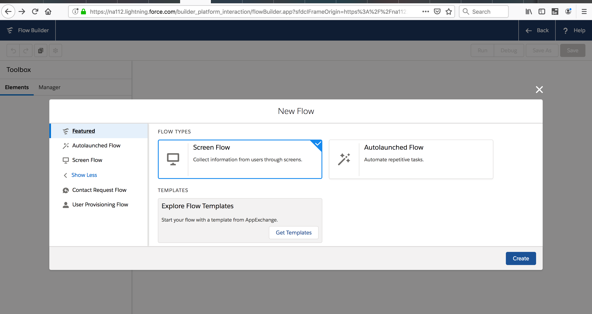

## Platform App Builder Spring 19

### Build Flows More Intuitively with Flow Builder

 Cloud Flow Designer  --> Flow Builder 
We’re replacing Cloud Flow Designer with a much faster tool: Flow Builder. It streamlines flow building and maintenance with a simplified user interface.

Similar to Lightning App Builder or Community Builder.

- Flow Builder is available to admins with the **Manage Flow user permission**. 

- we consolidated the data elements and how you create variables.

-  Flow Builder is now the default flow-building tool in all orgs—Salesforce Classic or Lightning Experience—so no migration is needed

#### New Flow

### What happened to Cloud Flow Designer

Cloud Flow Designer is disabled by default, but you can turn it back on. From Setup, go to Process Automation Settings and deselect Disable access to Cloud Flow Designer.

When both tools are enabled, a flow opens in the tool that it was built with.

Adobe Flash is no longer required to build a flow. We updated flow error messages, including those that are returned via Cloud Flow Designer, Metadata API, and Tooling API, to reflect the terminology used in Flow Builder. If you’ve written code that checks for specific error strings, you might need to update that code. The terminology in some warnings, error messages, and debug details aren’t updated for Flow Builder or Cloud Flow Designer.

### LWC

Building Lightning Web Components

#### 2 ways
1. Lightning Web Components, 
2. original model, Aura Components

Lightning web components and Aura components can coexist and interoperate on a page. To admins and end users, they both appear as Lightning components.

This feature is available in Lightning Experience, Lightning Communities, and all versions of the mobile app in all editions. To create a Lightning web component, use Enterprise, Performance, Unlimited, and Developer editions.

Lightning Web Components brings the latest advancements in JavaScript and web standards to the Lightning Component framework. Since we introduced the Lightning Component framework in 2014, the web stack has evolved into an application development platform. Many features that required frameworks are now standard. We developed the Lightning Web Components programming model to take advantage of this evolution. Salesforce engineers helped lead the way on TC39, which is the committee that defines ECMAScript (JavaScript).

-[Core web components](https://github.com/w3c/webcomponents/)
-[TC39](https://tc39.github.io/ecma262/)

You can also use the components, tools, and services that make it easy to develop on the Lightning Platform: Base Lightning Components, Lightning Design System, Lightning App Builder, Community Builder, Lightning Data Service, and Lightning Locker

se the Salesforce CLI to synchronize Lightning Web Components source code between Salesforce and your favorite code editor. We recommend Visual Studio Code because the Salesforce Extension Pack includes Salesforce CLI commands, code completion, and linting, which make coding faster and more fluid.

## Stay on Time with Relative Dates for Macros
Rather than using precise dates and times in your macros, use relative dates and times that always remain applicable, even when the schedule slips

##  Customized Home Pages and Components

- Add a Rich Text Component using the Quill text editor.
- Set Component visibility based on Standard or Custom user permissions.

To ensure that the Rich Text component works smoothly with **Lightning Locker**, we changed its text editor from **CKEditor to Quill**.

- [quill editor](https://quilljs.com/)
- [CKEditor](https://ckeditor.com/)

- The Quill editor supports a different set of fonts than CKEditor. The text in your component remains in the old font until you edit it. Quill’s supported fonts are Arial, Courier, Garamond, Salesforce Sans, Tahoma, Times New Roman, and Verdana.

- The Quill API wraps each line of text with 
 
 tags. The tags can increase the number of characters in the rich text API value when you save the text. If you get a max length warning, break up the text into two Rich Text components.

- The link editor panel in Quill has fewer options than CKEditor. For example, the Quill panel doesn’t include the Link Type option, but you can specify it manually.

- [Quill UI](he link editor panel in Quill has fewer options than CKEditor. For example, the Quill panel doesn’t include the Link Type option, but you can specify it manually.)

- A link target can be added only via the Metadata API.
- In Quill, the default color for text is gray in the editor, but the text renders black in the output.

- If you select text using keyboard shortcuts, such as Cmd/Ctrl+A, and then type something new, Quill resets the formatting of the existing text

## Set Component Visibility Based on Standard and Custom User Permissions

you can make your Lightning pages more dynamic by configuring component visibility filters based on the permissions of the person viewing the page. 

You can create a rule for a component to display for users with a specific permission, but it’s hidden for everyone else. Component visibility filters are supported for standard components, custom components, and components from AppExchange.

