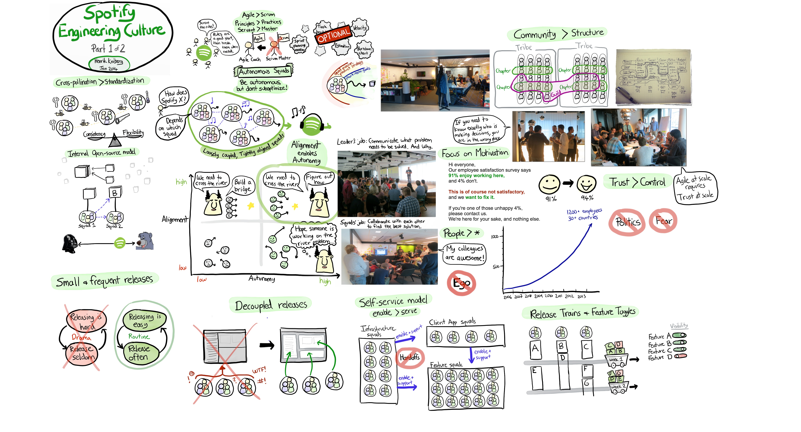

### Spotify

#### Key points

 - Continuous improvement:  Look for ways to continuously improve, both personally, and in the wider organization.
 - Iterative development:  Believe in short learning cycles, so that we can validate our assumptions as quickly as possible.
 - Simplicity:     Simplicity should be your guidance during scaling. This is as true for our technical solutions, as for our methods of working and organizing the organization.
 - Trust: Trust our people and teams to make informed decisions about the way they work and what they work on.
 - Servant leadership: Managers are focused on coaching, mentorship, and solving impediments rather than telling people what to do.

### Resources

- [Agile à la Spotify](https://labs.spotify.com/2013/03/20/agile-a-la-spotify/)
- [How to Build Your Own “Spotify Model”](https://medium.com/the-ready/how-to-build-your-own-spotify-model-dce98025d32f)

