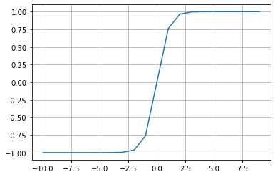
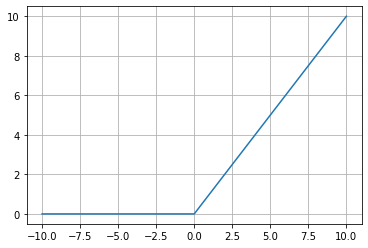

# Activation Function

Activation function is a function that is added into an artificial neural network in order to help the network learn complex patterns in the data. 

When comparing with a neuron-based model that is in our brains, the activation function is at the end deciding what is to be **fired to the next neuron**


## Sigmoid function
A sigmoid function is a mathematical function having a characteristic "S"-shaped curve or sigmoid curve.


- \\( \sigma(x) =  \frac{1}{1 + e^{-x}}\\)


```py

import math
import matplotlib.pyplot as plt
import numpy as np

def sigmoid(x):
    a = []
    for item in x:
        a.append(1/(1 + math.exp(-item)))
    return a

x = np.arange(-10., 10., 0.2)
sig = sigmoid(x)

# plot sig
plt.plot(x,sig)
plt.show()

```


## Hyperbolic tangent activation function 

It is also referred  the \\(Tanh\\) (also “tanh” and “TanH“) function. 
It is very similar to the **sigmoid activation function** and even has the same S-shape. 
The function takes any real value as input and outputs values in the range -1 to 1.

```py
# plot for the tanh activation function
from math import exp
import matplotlib.pyplot as plt
 
# tanh activation function
def tanh(x):
	return (exp(x) - exp(-x)) / (exp(x) + exp(-x))
 
# define input data
inputs = [x for x in range(-10, 10)]
# calculate outputs
outputs = [tanh(x) for x in inputs]

# plot inputs vs outputs
plt.plot(inputs, outputs)
plt.grid()
plt.show()

```



[Refer: How to Choose an Activation Function for Deep Learnin](https://machinelearningmastery.com/choose-an-activation-function-for-deep-learning/)

## Softmax

```py
from numpy import exp

# softmax activation function
def softmax(x):
	return exp(x) / exp(x).sum()

# define input data
inputs = [1.0, 3.0, 2.0]
# calculate outputs
outputs = softmax(inputs)
# report the probabilities
print(outputs)
# report the sum of the probabilities
print(outputs.sum())

```

```bash
[0.09003057 0.66524096 0.24472847]
1.0
```

## Rectified Linear Activation Function 

A node or unit that implements this activation function is referred to as a rectified linear activation unit, or ReLU for short. 


```py

# demonstrate the rectified linear function
 
# rectified linear function
def rectified(x):
	return max(0.0, x)
 
# demonstrate with a positive input
x = 1.0
print('rectified(%.1f) is %.1f' % (x, rectified(x)))
x = 1000.0
print('rectified(%.1f) is %.1f' % (x, rectified(x)))
# demonstrate with a zero input
x = 0.0
print('rectified(%.1f) is %.1f' % (x, rectified(x)))
# demonstrate with a negative input
x = -1.0
print('rectified(%.1f) is %.1f' % (x, rectified(x)))
x = -1000.0
print('rectified(%.1f) is %.1f' % (x, rectified(x)))

```

### Plotting
```py
# plot inputs and outputs
from matplotlib import pyplot
 
# rectified linear function
def rectified(x):
	return max(0.0, x)
 
# define a series of inputs
series_in = [x for x in range(-10, 11)]
# calculate outputs for our inputs
series_out = [rectified(x) for x in series_in]
# line plot of raw inputs to rectified outputs
pyplot.plot(series_in, series_out)
pyplot.show()
```

 


