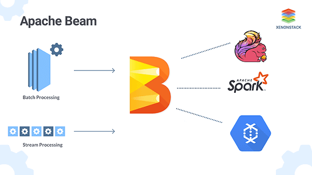

# Apache Beam

Apache Bean help us to implement **batch and streaming data processing jobs** that run on any execution engine.

Several TFX (TensorFlow Extended) components rely on Beam for **distributed data processing**. 
In addition, TFX can use Apache Beam to orchestrate and execute the pipeline DAG. 

Beam orchestrator uses a different **BeamRunner** than the one which is used for component data processing. 
With the default **DirectRunner** setup the Beam orchestrator can be used for local debugging without incurring the extra **Airflow or Kubeflow dependencies**, which simplifies system configuration.

<iframe width="720" height="480" src="https://www.youtube.com/embed/udKgN1_eThs" title="YouTube video player" frameborder="0" allow="accelerometer; autoplay; clipboard-write; encrypted-media; gyroscope; picture-in-picture" allowfullscreen></iframe>
