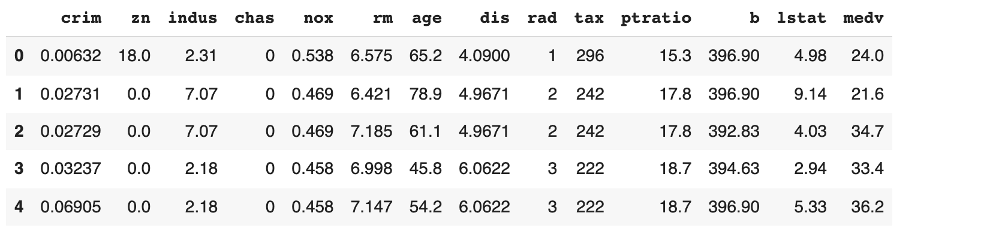
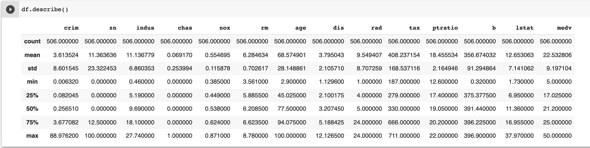

# Chapter 1 : Quick Introduction

- In traditional programming we start with **data** and **rules** to apply on the data to get **answers**. This style of programming can't bring answers for problems predicting a type of cat in the cat picture.

As shown in the demo below, user provides a image of the cat, the application predicts type of the cat in that image with a confidence (probability) with help of Machine Learning.


To build this kind of solution using traditional programming, we may have to write too many rules or sometimes this problem is not easily solvable by our traditional programming. Here comes our hero **Machine Learning** to our rescue us!


## What is special about Machine Learning ?

How long it will take to write the code for **Solving Rubik’s Cube with a single Robot Hand** using our traditional programming? 

<iframe width="720" height="480" src="https://www.youtube.com/embed/kVmp0uGtShk" title="YouTube video player" frameborder="0" allow="accelerometer; autoplay; clipboard-write; encrypted-media; gyroscope; picture-in-picture" allowfullscreen></iframe>


## Steps in the ML

### Goal:  Create an accurate Model that answers our questions most of time

### Step-1 - Gathering Data
-   To train a Model we need to
    - Collect data to train on
- For our example let us get the data of [Boston House prices](https://www.cs.toronto.edu/~delve/data/boston/bostonDetail.html)
    - [Boston House Price Dataset](https://raw.githubusercontent.com/mohan-chinnappan-n/ml-book-assets/master/BostonHousing.csv)


### Step-2 - Data Preparation

- Load the data and visualize it
- Check for data errors and data imbalances
- Split the data into 2 parts
    - 1. Training Data (80%)
    - 2. Testing Data (20%)

```py

import pandas as pd

url="https://raw.githubusercontent.com/mohan-chinnappan-n/ml-book-assets/master/BostonHousing.csv"
df = pd.read_csv(url)
df.head()

```





There are 14 attributes (**features**) in each case of the dataset. They are:

```
CRIM - per capita crime rate by town
ZN - proportion of residential land zoned for lots over 25,000 sq.ft.
INDUS - proportion of non-retail business acres per town.
CHAS - Charles River dummy variable (1 if tract bounds river; 0 otherwise)
NOX - nitric oxides concentration (parts per 10 million)
RM - average number of rooms per dwelling
AGE - proportion of owner-occupied units built prior to 1940
DIS - weighted distances to five Boston employment centres
RAD - index of accessibility to radial highways
TAX - full-value property-tax rate per $10,000
PTRATIO - pupil-teacher ratio by town
B - 1000(Bk - 0.63)^2 where Bk is the proportion of blacks by town
LSTAT - % lower status of the population
MEDV - Median value of owner-occupied homes in $1000's

```


### Step-3 - Choosing a Model

In our case, we can use a linear model.


### Step-4 - Training the Model


 Model 
 - \\(y = mx + b\\)

- \\(x\\) is the input
- \\(y\\) is the output (prediction)

The values we are to going to adjust the training are:
- \\(m\\) (weight) and \\(b\\) (bias)

- Start the training by initializing  \\(m\\) (weight) and \\(b\\) (bias) with some random values
- At the beginning, the Model will perform very poorly
    - We compare the model's output \\(y\\) with what it should have produced (target value of y)
    - We will adjust values of \\(m\\) (weight) and \\(b\\) (bias) so that we get more accurate predictions on the next time around
    - This error correction repeats...
        - Each iteration updates \\(m\\) (weight) and \\(b\\) (bias) - called *one training step*
    - We will stop the training once we got the good accuracy (low error)


### Step-5 - Evaluating the Model
- We can check the fitness of our Model using Evaluation
- We test our Model against the **Testing Data** we created in Step-2
    - We are testing the model against data the Model has not seen yet (simulating the real-world situation)
    
### Step-6 - Parameter Tuning 
Parameters (AKA hyper-parameters) we can tune:
- How many times we run through the training dataset?
- Learning Rate
    - How far we did the error correction based on the information from the previous training step

These parameters determine:
- Accuracy of our Model
- How long it takes to train the Model

How we initialized the Model affects the Model training time
    - Random values or
    - Zero values

### Step-7 - Predication/Inference

We can use our Model to predict the values for the given input.
Power here is we can predict the values for the given input with our Model
    - not by human judgement and manual rules


<iframe width="780" height="420" src="https://www.youtube.com/embed/nKW8Ndu7Mjw" title="YouTube video player" frameborder="0" allow="accelerometer; autoplay; clipboard-write; encrypted-media; gyroscope; picture-in-picture" allowfullscreen></iframe>


