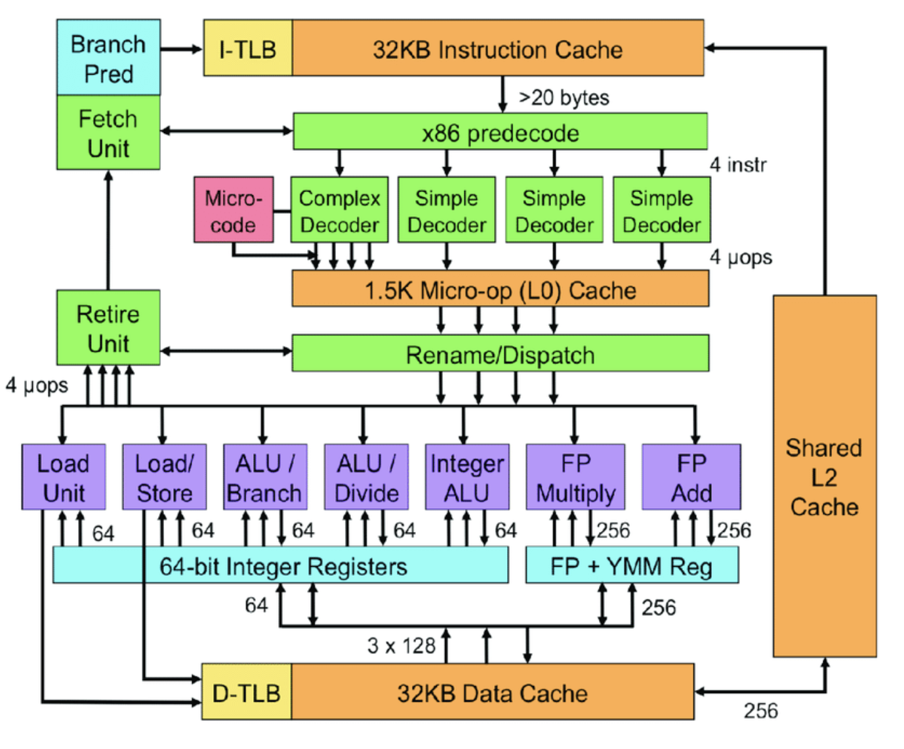

# CPU
CPU is constructed from millions of transistors.
It can have **multiple processing cores** and is commonly referred to as the brain of the computer. 
It is essential to all modern computing systems as it executes the commands and processes needed for your computer and operating system. 
The CPU is also important in determining how fast programs can run, from surfing the web to building spreadsheets.

The CPU is suited to a wide variety of workloads, especially those for which latency or per-core performance are important. A powerful execution engine, the CPU focuses its **smaller number of cores on individual tasks and on getting things done quickly. This makes it uniquely well equipped for jobs ranging from serial computing to running databases.

## Intel's Sandy Bridge Architecture ( 32 nm micro architecture)

- [Refer](https://en.wikipedia.org/wiki/Sandy_Bridge#:~:text=Sandy%20Bridge%20is%20the%20codename,to%20Nehalem%20and%20Westmere%20microarchitecture.)
