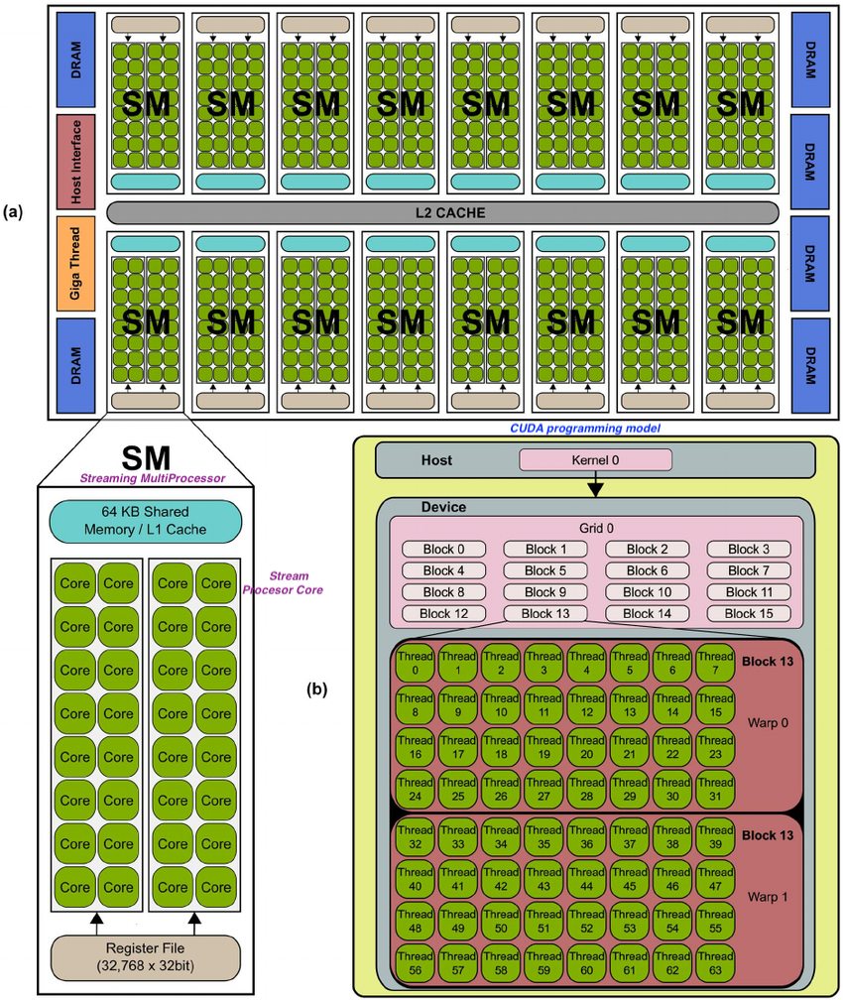

# GPU

The GPU is a processor that is made up of many smaller and more **specialized cores**. By working together, these cores deliver **massive performance** when a processing task can be **divided up** and processed across these cores.

GPUs began as specialized [ASICs - Application Specific Integrated Circuit](https://en.wikipedia.org/wiki/Application-specific_integrated_circuit) developed to **accelerate specific 3D rendering tasks**. 

Over time, these fixed-function engines became more programmable and more flexible. While graphics and the increasingly lifelike visuals of today’s top games remain their principal function, GPUs have evolved to **become more general-purpose parallel processors as well**, handling a growing range of applications.

Initially GPUs were solving computer **graphics** related problems in Gaming
The General Purpose GPU (GPGPU) plays a vital role in the deep learning and parallel computing.

### What is CUDA?
Compute Unified Device Architecture ([CUDA](https://developer.nvidia.com/blog/cuda-refresher-getting-started-with-cuda/)) is is a parallel computing platform developed by NVIDIA. It enables software programs to perform calculations using both the CPU and GPU.

