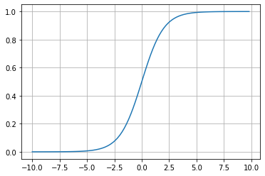

# Gradient descent

[Gradient descent](https://ml-cheatsheet.readthedocs.io/en/latest/gradient_descent.html) is an optimization algorithm used to:
 - minimize some function (cost function) by iteratively moving in the **direction of steepest descent** as defined by the negative of the gradient. 
 
 In machine learning, we use gradient descent to update the parameters (weights and biases) of our model.

 

- Starting at the top of the mountain, we take our first step *downhill* in the direction specified by the *negative gradient*. 
- Next we recalculate the negative gradient (passing in the coordinates of our new point) and take another step in the direction it specifies. 
- We continue this process iteratively until we get to the *bottom of our graph*, or to a point where we can no longer move downhill.

## Learning Rate
The size of these steps is called the **learning rate**.

With a **high learning rate** we can cover more ground each step, but we risk overshooting the lowest point since the slope of the hill is constantly changing.

With a **very low learning rate**, we can confidently move in the direction of the negative gradient since we are recalculating it so frequently. A low learning rate is more precise, but calculating the gradient is time-consuming, so it will take us a very long time to get to the bottom.


## Cost function
- It is a loss function. 
- It is a measure of how wrong the model is in terms of its ability to estimate the relationship between x and y 
- It is a measure of how far we are away from the target:
    - \\(y - (mx + b)\\)
    - Cost function :
        - \\[ f(m,b) = \frac{1}{N} \sum_{i=0}^n (y_i - (mx_i + b))^2 \\]
 

- This tells us **how bad** our model is at making predictions for a given set of parameters. 

The cost function has its own curve and its own gradients. The slope of this curve tells us how to update our parameters (weight) to make the model more accurate.

We run gradient descent using our cost function.

- Calculate the partial derivatives of the cost function \\( f(m,b)    \\) with respect to each parameter( m and b) and store the results in a gradient.
- This new gradient tells us the slope of our cost function at our current position (current parameter values) and the direction we should move to update our parameters (m and b).

### Derivative
[Derivative](https://en.wikipedia.org/wiki/Derivative) of a function of a real variable measures the sensitivity to change of the function value (output value) with respect to a change in its argument (input value).


The slope of the tangent line is equal to the derivative of the function at the marked point.   


### Partial derivative
- [Partial derivative](https://en.wikipedia.org/wiki/Partial_derivative) of a function of several variables (in our case m and b)  is:
    -  its [derivative](https://en.wikipedia.org/wiki/Derivative) with respect to one of those variables.

- with respect to m (weight): \\( \frac{df}{dm}\\)
    - -2x(y - (mx + b))
    -   \\[  \frac{1}{N} \sum_{i=0}^n -2x_i(y_i - (mx_i + b)) \\]


- with respect to b (bias): \\( \frac{df}{db}\\)
    - -2(y - (mx + b))
    -  \\[  \frac{1}{N} \sum_{i=0}^n -2(y_i - (mx_i + b)) \\] 


<iframe width="720" height="480" src="https://www.youtube.com/embed/HaHsqDjWMLU" title="YouTube video player" frameborder="0" allow="accelerometer; autoplay; clipboard-write; encrypted-media; gyroscope; picture-in-picture" allowfullscreen></iframe>


<iframe width="720" height="480" src="https://www.youtube.com/embed/tIeHLnjs5U8" title="YouTube video player" frameborder="0" allow="accelerometer; autoplay; clipboard-write; encrypted-media; gyroscope; picture-in-picture" allowfullscreen></iframe>


```py


# Y is target for the given input X
# mx + b is predicted
# learning_rate is size of the steps

def update_weights(m, b, X, Y, learning_rate):
    m_deriv = 0
    b_deriv = 0
    N = len(X)
    for i in range(N):
        # Calculate partial derivatives

        # -2x(y - (mx + b))
        m_deriv += -2*X[i] * (Y[i] - (m*X[i] + b))

        # -2(y - (mx + b))
        b_deriv += -2*(Y[i] - (m*X[i] + b))

    # We subtract because the derivatives point in direction of steepest ascent
    m -= (m_deriv / float(N)) * learning_rate
    b -= (b_deriv / float(N)) * learning_rate

    return m, b

```

## Sigmoid function
A sigmoid function is a mathematical function having a characteristic "S"-shaped curve or sigmoid curve.


- \\( \sigma(x) =  \frac{1}{1 + e^{-x}}\\)

```py

import math
import matplotlib.pyplot as plt
import numpy as np

def sigmoid(x):
    a = []
    for item in x:
        a.append(1/(1 + math.exp(-item)))
    return a

x = np.arange(-10., 10., 0.2)
sig = sigmoid(x)

# plot sig
plt.plot(x,sig)
plt.show()

```


<iframe width="720" height="480" src="https://www.youtube.com/embed/IHZwWFHWa-w" title="YouTube video player" frameborder="0" allow="accelerometer; autoplay; clipboard-write; encrypted-media; gyroscope; picture-in-picture" allowfullscreen></iframe>


