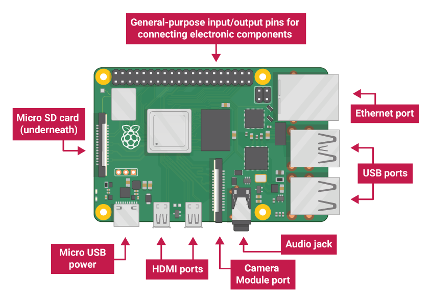

# Raspberry Pi

The Raspberry Pi is a **small computer** that can do **lots of things**. 

You plug it into a monitor and attach a keyboard and mouse.





## Tensorflow Lite on Pi

<iframe width="720" height="460" src="https://www.youtube.com/embed/aimSGOAUI8Y" title="YouTube video player" frameborder="0" allow="accelerometer; autoplay; clipboard-write; encrypted-media; gyroscope; picture-in-picture" allowfullscreen></iframe>


## Raspberry PI emulation on macOS

```
# install info: https://github.com/faf0/macos-qemu-rpi
# https://joshondesign.com/2021/04/15/emu_pi_mac

pi@raspberrypi:~$ uname -a
Linux raspberrypi 5.4.51 #1 Sat Aug 8 23:28:32 +03 2020 armv6l GNU/Linux
pi@raspberrypi:~$ 


```

## Resources
- [Raspberry Pi Getting Started](https://projects.raspberrypi.org/en/projects/raspberry-pi-getting-started/1)
- [Raspberry Development Environment on MacOSX with QEMU](https://florianmuller.com/raspberry-development-environment-on-macosx-with-qemu)

- TensorFlow Lite
    - [Part 2 - How to Run TensorFlow Lite Object Detection Models on the Raspberry Pi](https://github.com/EdjeElectronics/TensorFlow-Lite-Object-Detection-on-Android-and-Raspberry-Pi/blob/master/Raspberry_Pi_Guide.md)
    - [TensorFlow-Lite-Object-Detection-on-Android-and-Raspberry-Pi](https://github.com/EdjeElectronics/TensorFlow-Lite-Object-Detection-on-Android-and-Raspberry-Pi)

- Cell phone
    - [Make Your Own Raspberry Pi Cell Phone](https://www.youtube.com/watch?v=jjX7nS3kIao)