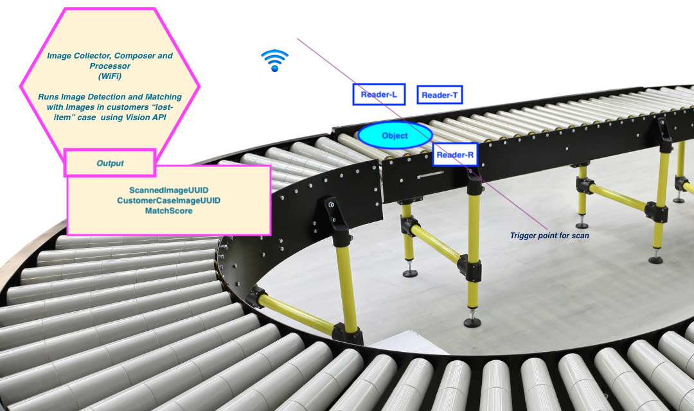

# Lost-Found Item Management

## Problem Description

Parcel delivery companies like UPS, FedEx needs a **lost-and-found management** solution:

There is possibility that item(s) packaged by the customers may fall out and becomes a candidate for the lost-and-found item

## Solution

We can build a ML and Deep Learning based Image detection and comparison system.

### How this works?

- We have a database of the images which customers have reported that they have lost

- At the storage and processing facility, we run those lost-and-found items on a conveyor

- When the item reaches the Trigger point for scan image capture devices at Reader-L, Reader-R and Reader-T captures images at left, right and top. This may include bar-codes, UPC, QR-Code

- These images are sent via WiFI to Image Collection, Composer and Processor (ICCP) device

- ICCP makes use of Vision API and runs:

    - Image Detection of the composed image (composed out of 3 images received for this item)

    - Image Compare to compare images stored in the Customer cases

    - Stores these attributes
        - ScannedImageUUID
        - CustomerCaseImageUUID
        - MatchScore

Based on the MatchScore we can detect/match the owner of this lost-and-found item

