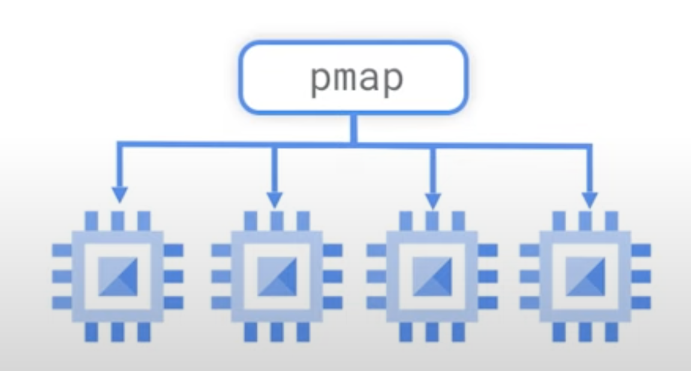
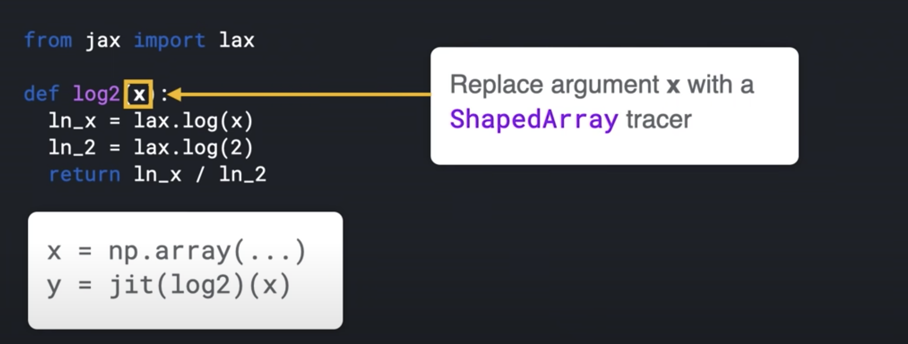
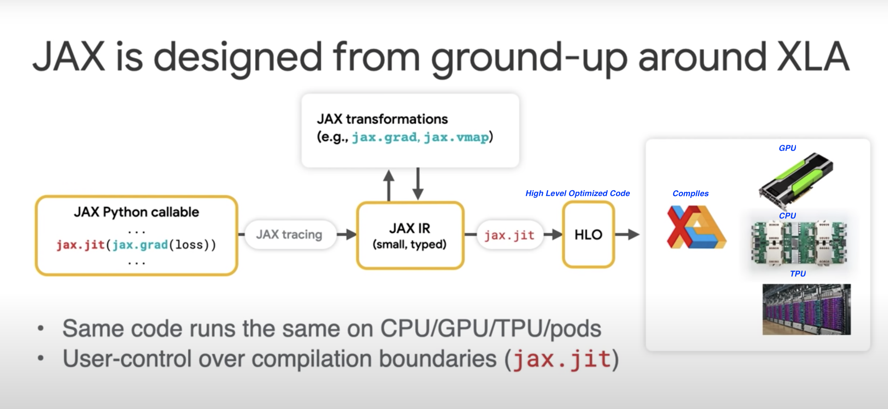

# 12. JAX


[JAX](https://github.com/google/jax) is a new library from [Google Research](https://research.google/). 
JAX can automatically differentiate native Python and Numpy functions.
- Loops
- Branches
- Recursion 
- [Closures](closure.html)
- Can take Derivative of Derivatives
    - Supports **reverse mode differentiation**, also known as [Back Propagation] using Grad function
     - Supports **forward mode differentiation**

 

## XLA
[XLA](https://www.tensorflow.org/xla) is **Accelerated Linear Algebra**. 

- It is a **domain-specific compiler** for **linear algebra** that can **accelerate TensorFlow models** with potentially **no source code changes**.

- Performs optimizations like:
    - **Fusing** operations together (something like consolidation) so the intermediate results do not have to written out the memory. Instead it get **streamed** into next operation.
    - This enable faster and more efficient processing
    
     This is some what **crudely** equal to nodejs stream:
        - Refer: TableauCRM CLI using this stream concept, where it loads data from a Oracle SQL Query results directly into Tableau CRM dataset
        - [refer: sfdx mohanc:ea:dataset:loadFromOra](https://github.com/mohan-chinnappan-n/cli-dx/blob/master/db/ora2ea.md)


    ```py
     def model (x, y, z):
         return tf.reduce_sum( x + y * z)
    ```

JAX uses XLA to compile and run our Numpy program on [GPUs](https://www.intel.com/content/www/us/en/products/docs/processors/what-is-a-gpu.html) and [TPUs](https://cloud.google.com/tpu/docs/tpus)

JAX uses JIT (just-in-time) compile of custom functions into XLA optimized kernels using decorator ```@jit ```

```py

@jit # jit decorator
def update(params, x, y):
    grads = gard(loss)(params, x, y)
    return [ (w - step_size * dw, b - step_size * db) for (w, b), (dw, db) in zip (params, grads)]

```


## pmap

- JAX applies pmap ([Parallel Map](https://jax.readthedocs.io/en/latest/jax.html#parallelization-pmap)) replicating computations across multiple cores


## Autograd

Autograd (https://github.com/hips/autograd) can automatically differentiate native **Python and Numpy** code.


### Functions available for the transformations

- grad
- jit
- pmap
- vmap - automatic vectorization
    - allowing us to turn a function which can handle only **one data point** into a function which can handle **batch of these data points** of any size with just one wrapper function *vmap*

### [Sample - MNIST ](https://colab.research.google.com/github/google/jax/blob/master/docs/notebooks/neural_network_with_tfds_data.ipynb)
- [MIST Database](http://yann.lecun.com/exdb/mnist/)

```py

import jax.numpy as jnp
from jax import grad, vmap, jit


def predict(params, inputs):
  for W, b in params:
    outputs = jnp.dot(inputs, W) + b
    inputs = jnp.tanh(outputs)
  return outputs

def loss (params, batch):
  inputs, targets = batch
  preds = predict(params, inputs)
  return jnp.sum( (preds - targets) **2 ) # SME


gradient_fun = jit(grad(loss))
preexample_grads = vmap(grad(loss), in_axes=(None, 0))

```


### Key Ideas
- Python code is traced into an Intermediate Representation (IR)
    - IR can be transformed (automatic differentiation) 
    - IR enables domain-specific compilation (XLA - Accelerated Linear Algebra)
- Has very powerful transforms
    - grad
    - jit
    - vmap
    - pmap
- Python's dynamism makes this possible
    - JAX makes use of this dynamism and evaluates a function's behavior by calling it on a **tracer** value

```py
def sum(x):
    return x + 2

class ShapedArray(object):
    def __add__ (self, other):
        self.record_computation("add", self, other)
        return ShapedArray(self.shape, self.dtype) # dtype is like float32

sum( ShapedArray( (2,2), float32 ))


```




With this IR, JAX knows how to do the transforms like:
- grad
- jit
- vmap
- pmap




```py
TF_CPP_MIN_LOG_LEVEL=0 

import jax
import jax.numpy as jnp

global_list = []

def log2(x):
  global_list.append(x)
  ln_x = jnp.log(x)
  ln_2 = jnp.log(2.0)
  return ln_x / ln_2

print( jax.make_jaxpr(log2)(3.0) )

```
- [Document](https://jax.readthedocs.io/en/latest/jax-101/02-jitting.html#how-jax-transforms-work)
- Output 

``` 
{ lambda ; a:f32[]. let
    b:f32[] = log a
    c:f32[] = log 2.0
    d:f32[] = div b c
  in (d,) 
}

```


### Jake on JAX
<iframe width="720" height="480" src="https://www.youtube.com/embed/WdTeDXsOSj4" title="YouTube video player" frameborder="0" allow="accelerometer; autoplay; clipboard-write; encrypted-media; gyroscope; picture-in-picture" allowfullscreen></iframe>


<iframe width="720" height="480" src="https://www.youtube.com/embed/0mVmRHMaOJ4" title="YouTube video player" frameborder="0" allow="accelerometer; autoplay; clipboard-write; encrypted-media; gyroscope; picture-in-picture" allowfullscreen></iframe>


<iframe width="720" height="480" src="https://www.youtube.com/embed/fuAyUQcVzTY" title="YouTube video player" frameborder="0" allow="accelerometer; autoplay; clipboard-write; encrypted-media; gyroscope; picture-in-picture" allowfullscreen></iframe>


