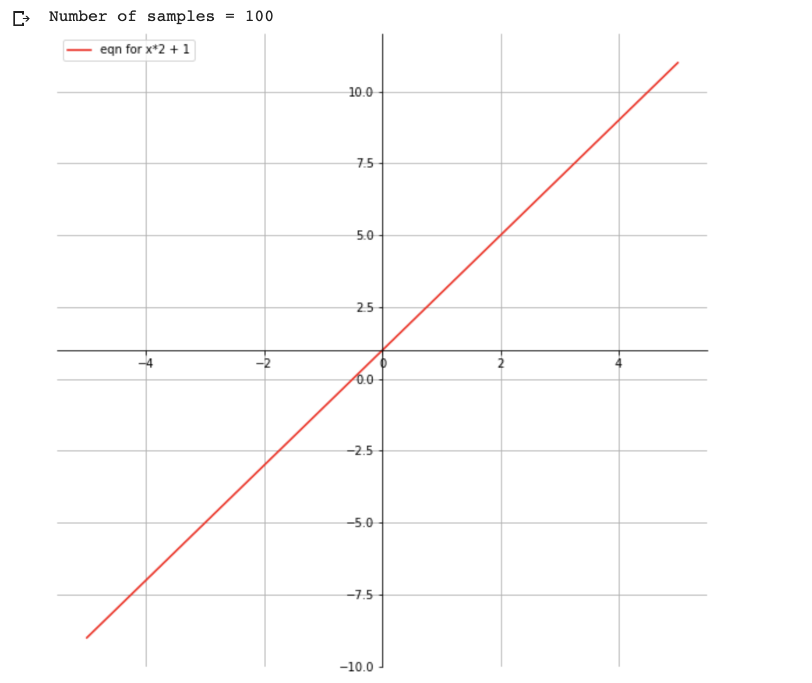

# 3. ML Models

## Simple model

\\( y = mx + b \\)
```
 where
 m = slope (gradient)
 b = y-intercept

x is the independent variable
y is the dependent variable depends on m and b

```

### Plotting the equation   

\\( y = x*2 + 1 \\)


```py
import matplotlib.pyplot as plt
import numpy as np

# setup the plot size 10 inches by 10 inches
fig = plt.figure(figsize=(10,10))

# 1 row, 1 col, and index is 1
ax = fig.add_subplot(111)

# put grid in the plot
plt.grid()

# let us generate x values start from -5 to 5  with 100 samples
x = np.linspace(-5,5,100)
print ('Number of samples = {}' .format(len(x)))

ax.spines['left'].set_position('center')
ax.spines['bottom'].set_position('center')

ax.spines['right'].set_color('none')
ax.spines['top'].set_color('none')

# we need ticks at bottom and left
ax.xaxis.set_ticks_position('bottom')
ax.yaxis.set_ticks_position('left')

## our plot function
def plot_eqn(eqn,  color, label):
  plt.plot(x, eqn, color, label=label)
  # put legend at upper left cornor
  plt.legend(loc='upper left')

plot_eqn( x*2 + 1, '-r', 'eqn for x*2 + 1')
#plot_eqn( x*2 - 1, '-b', 'eqn for x*2 - 1')
#plot_eqn( x*2 - 3, ':b', 'eqn for x*2 - 3')
#plot_eqn( x*2 + 3, '--m', 'eqn for x*2 + 3')

## show our plot
plt.show()


```

## What happens when we train a ML model for this equation?
- We provide a training dataset with values for **x** and **y**

| x |  y|
|---|---|
|  2|  5|
|  1|  3|
|  7|  15|
|...| ...|


- During the training ML Model calculates the optimum value for **m** and **b** variables based on the training dataset we have provided
- Once training completed, ML model is ready for predicting value for **y** for the given **x**

```
 You:   Hey, model my x value is 2, can you predict the value of y?
 Model: Sure, it is 5
```

