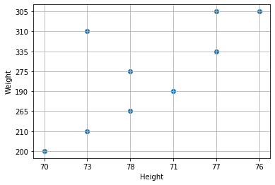
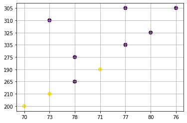
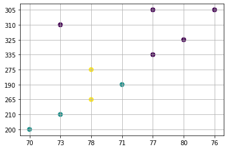

# Unsupervised Learning
- Given a set of feature vectors (without labels)
- Group them into **natural clusters** or create labels for groups


Here are some data on the New England Patriots and let us see how we can use clustering to create groups.

```


Features:
 Name, height, weight
 
 Labeled by type of position

Receivers: (label)
    edelman = ['edelman’, 70, 200]  <---- Feature vector
    hogan = ['hogan', 73, 210]
    gronkowski = ['gronkowski', 78, 265]
    amendola = ['amendola’, 71, 190]
    bennett = ['bennett’, 78, 275]

Linemen: (label)
    cannon = ['cannon’, 77, 335]
    solder = ['solder', 80, 325]
    mason = ['mason’, 73, 310]
    thuney = ['thuney', 77, 305]
    karras = ['karras', 76, 305]

```

```py

# r: receiver, l: linemen
ne_fb_players = [["edelman", 70, 200, "r"],
                 ["hogan", 73, 210, "r"],  
                 ["gronkowski", 78, 265, "r"], 
                 ["amendola", 71, 190, "r"], 
                 ["bennett", 78, 275, "r"],

                 ["cannon", 77, 335, "l"],
                 ["solder", 80, 325, "l"],
                 ["mason", 73, 310, "l"],
                 ["thuney", 77, 305, "l"],
                 ["karras", 76, 305, "l"]
                 
                 ]

import numpy as np
import matplotlib.pyplot as plt
nep_dataset = np.array(ne_fb_players)


plt.scatter( nep_dataset[:, 1], nep_dataset[:, 2])

plt.xlabel("Height")
plt.ylabel("Weight")

plt.grid()
plt.show()


```


```py

X = nep_dataset[:, 1:3]
print (X)
kmeans = KMeans(n_clusters=2, random_state=0).fit(X)
kmeans.labels_

```

```

[['70' '200']
 ['73' '210']
 ['78' '265']
 ['71' '190']
 ['78' '275']
 ['77' '335']
 ['80' '325']
 ['73' '310']
 ['77' '305']
 ['76' '305']]
array([1, 1, 0, 1, 0, 0, 0, 0, 0, 0], dtype=int32)

```

As we the first 2 items and 4th item are in one cluster while all others in the second cluster

```py
plt.scatter(X[:, 0], X[:, 1], c=y_kmeans, s=50, cmap='viridis')

# colormap viridis: https://matplotlib.org/stable/tutorials/colors/colormaps.html
 
plt.grid()
plt.show()

```


If we want to group them into 3 clusters, we need to provide n_clusters=3 as shown below:

```
kmeans = KMeans(n_clusters=3, random_state=0).fit(X)

```



### K-Means

<a href="https://colab.research.google.com/github/jakevdp/PythonDataScienceHandbook/blob/master/notebooks/05.11-K-Means.ipynb"> - Introducing k-Means</a>