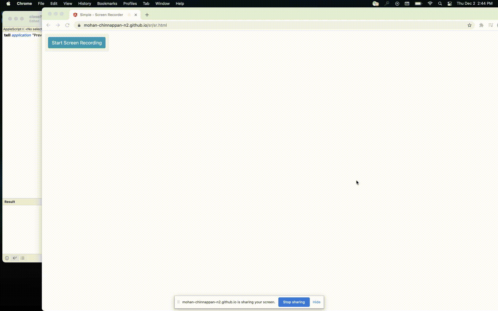

# About AppleScript

- Task involving multiple apss


## Verbs
- open
- close

- make
- delete

- print

- get
- set

## objects (nouns)
- window
- document
- box

- image


## Specifiers

- first
- last
- middle
- every
- some (random)

- front
- back

### object has properties
- name
- height
- width


## whose clauses


## Examples

- it is semi-english

```
open window
open document

close document

get image name
get document width

get image's name
get the name of the image

set image's name to "green"

set image's width to 480

set every image width to 1280

get every images whose height is greater than 1080

get every image whose name contains "Bob"


tell application "Finder" to duplicate
(every document file of the entire contents of 
 folder "Documents" of home whose name contains
 "Green Project")
to the disk name "Green Backup"


```

## Testing

```
tell application "Finder" to close very window
```

### Demo


# Keynote

## Create a Keynote document
```
tell application "Keynote" to make new document

```


```
result
document id "ECCB6A6F-C0B8-47ED-8CA9-CC9EB23DB72E" of application "Keynote"
```

<hr/>

### Get all the themes ids

```
tell application "Keynote"
    get id of every theme
end tell

```

```
{"Application/21_BasicWhite/Standard", "Application/20_BasicBlack/Standard", "Application/23_ClassicWhite/Standard", "Application/White/Standard", "Application/Black/Standard", "Application/30_BasicColor/Standard", "Application/31_ColorGradientLight/Standard", "Application/22_ColorGradient/Standard", "Application/Gradient/Standard", "Application/Showroom/Standard", "Application/ModernPortfolio/Standard", "Application/New_Template2/Standard", "Application/New_Template1/Standard", "Application/25_BoldColor/Standard", "Application/27_Showcase/Standard", "Application/24_Briefing/Standard", "Application/28_Academy/Standard", "Application/New_Template7/Standard", "Application/New_Template9/Standard", "Application/26_FeatureStory/Standard", "Application/29_Lookbook/Standard", "Application/New_Template4/Standard", "Application/Editorial/Standard", "Application/New_Template3/Standard", "Application/Industrial/Standard", "Application/Blueprint/Standard", "Application/GraphPaper/Standard", "Application/Chalkboard/Standard", "Application/PhotoPortfolio/Standard", "Application/LeatherBook/Standard", "Application/New_Template5/Standard", "Application/New_Template6/Standard", "Application/New_Template8/Standard", "Application/Kyoto/Standard", "Application/BrushedCanvas/Standard", "Application/Craft/Standard", "Application/Parchment/Standard", "Application/Renaissance/Standard", "Application/Moroccan/Standard", "Application/HardCover/Standard", "Application/LinenBook/Standard", "Application/Vintage/Standard", "Application/Typeset/Standard", "Application/Harmony/Standard", "Application/Formal/Standard"}

```
### Get all the theme names

- [Refer](https://iworkautomation.com/keynote/theme.html)

```
tell application "Keynote"
    get name of every theme
end tell
```

```
{"Basic White", "Basic Black", "Classic White", "White", "Black", "Basic Color", "Color Gradient Light", "Color Gradient", "Gradient", "Showroom", "Modern Portfolio", "Slate", "Photo Essay", "Bold Color", "Showcase", "Briefing", "Academy", "Modern Type", "Exhibition", "Feature Story", "Look Book", "Classic", "Editorial", "Cream Paper", "Industrial", "Blueprint", "Graph Paper", "Chalkboard", "Photo Portfolio", "Leather Book", "Artisan", "Improv", "Drafting", "Kyoto", "Brushed Canvas", "Craft", "Parchment", "Renaissance", "Moroccan", "Hard Cover", "Linen Book", "Vintage", "Typeset", "Harmony", "Formal"}
```


### Create a keynote document

```
tell application "Keynote"
	make new document with properties {document theme:theme "Basic Black"}
end tell

```

### Checking

```
property thisThemeName : "Black"

tell application "Keynote"
	activate
	try
		-- GET THE THEME NAMES
		set the themeNames to the name of every theme
		
		-- CHECK FOR THEME
		if thisThemeName is not in the themeNames then
			error "The theme “" & thisThemeName & "” is not installed on this computer."
		end if
		
	on error errorMessage number errorNumber
		if errorNumber is not -128 then
			display alert ("ERROR " & errorNumber) message errorMessage
		end if
	end try
end tell

```

### New Document with Chosen Theme

```

tell application "Keynote"
	activate
	try
		-- get theme names
		set the themeNames to the name of every theme
		
		-- prompt user to pick a theme
		set thisThemeName to ¬
			(choose from list themeNames with prompt "Choose a theme:")
		if thisThemeName is false then error number -128
		
		-- convert resulting list into a string: {"Black"} to "Black"
		set thisThemeName to thisThemeName as string
		
		-- create a default document, styled with the chosen theme
		make new document with properties ¬
			{document theme:theme thisThemeName}
		
	on error errorMessage number errorNumber
		if errorNumber is not -128 then
			display alert "THEME ISSUE" message errorMessage
		end if
	end try
end tell

```

### Create, Play, Advance, and Stop Presentation

```
tell application "Keynote"
	activate
	
	set thisDocument to ¬
		make new document with properties ¬
			{document theme:theme "Black", width:1024, height:768}
	
	tell thisDocument
		set thisMasterSlide to slide layout "Title - Center"
		tell the first slide
			set the base layout to thisMasterSlide
			set the object text of the default title item to "HELLO"
		end tell
		set thisSlide to ¬
			make new slide with properties {base layout:thisMasterSlide}
		tell thisSlide
			set the object text of the default title item to "GOODBYE"
		end tell
	end tell
	
	-- begin presenting
	start thisDocument from the first slide of thisDocument
	delay 2
	-- show the next slide or build
	show next
	delay 2
	-- stop the presentation
	stop thisDocument
end tell

```

<a href="applescript://com.apple.scripteditor?action=new&amp;name=Make%20and%20Save%20New%20Document&amp;script=--%20Create%20a%20new%20document%20and%20save%20it%20into%20the%20Documents%20folder%0D%0D--%20generate%20the%20default%20file%20name%0Dset%20todaysDate%20to%20(current%20date)%0Dset%20the%20nameToUse%20to%20%C2%AC%0D%09(%22Monthly%20Report%20-%20%22%20%26%20(month%20of%20todaysDate)%20as%20string)%20%26%20%C2%AC%0D%09space%20%26%20(year%20of%20todaysDate)%20as%20string%0D--%3E%20%22Monthly%20Report%20-%20December%202014%22%0D%0D--%20make%20sure%20the%20file%20name%20is%20not%20in%20use%0Dset%20the%20destinationFolderHFSPath%20to%20%C2%AC%0D%09(path%20to%20the%20documents%20folder)%20as%20string%0Drepeat%20with%20i%20from%200%20to%20100000%0D%09if%20i%20is%200%20then%0D%09%09set%20incrementText%20to%20%22%22%0D%09else%0D%09%09set%20incrementText%20to%20%22-%22%20%26%20(i%20as%20string)%0D%09end%20if%0D%09set%20thisFileName%20to%20nameToUse%20%26%20incrementText%20%26%20%22.key%22%0D%09set%20thisFilePath%20to%20destinationFolderHFSPath%20%26%20thisFileName%0D%09tell%20application%20%22Finder%22%0D%09%09if%20not%20(exists%20document%20file%20thisFilePath)%20then%20exit%20repeat%0D%09end%20tell%0Dend%20repeat%0D%0Dtell%20application%20%22Keynote%22%0D%09activate%0D%09--%20create%20a%20new%20document%20and%20store%20its%20reference%20in%20a%20variable%0D%09set%20thisDocument%20to%20make%20new%20document%0D%09--%20save%20the%20document%0D%09save%20thisDocument%20in%20file%20thisFilePath%0Dend%20tell"><button type="button">Open in Script Editor</button></a>


# Pages

## Create page document
```
tell application "Pages"
	make new document with properties {document template:template "Visual Report"}
end tell

```

```
result

document id "2A6DEE60-F674-4F0F-8857-C1D1870D6CE0" of application "Pages"

```


