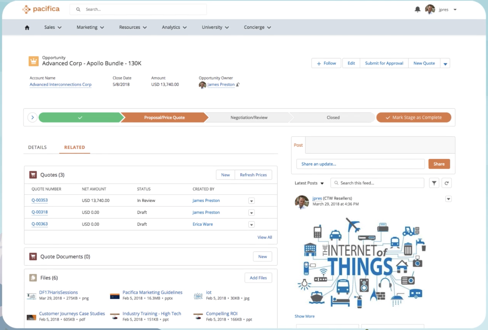

# Experience Cloud User Licenses

## What is free and what needs community licenses ?
- can create up to **100** Experience Cloud sites without buying communities licenses. 
- can have up to **100** Experience Cloud sites in your Salesforce org. Active, inactive, and preview sites, including Lightning Platform sites, count against this limit.
- need to purchase licenses to use specific templates and functionality
    -  Purchase licenses for external users to allow members to **log in or give access to Salesforce objects** based on your business needs. 
        - Purchasing external licenses also allows you to create **external profiles** (beyond the guest user profile) to access your sites.
    - Even without community licenses, guest users have some access to your sites (such as to **login and error pages**)

## What is External user licenses ?
- External user licenses are the only licenses suited to securely access an external facing portal or site.
- We **highly discourage** the use of **internal** licenses for external use cases

## Access types
-  2 types of access to Experiences Cloud sites
    - authenticated
        - users log in to the site,
    - unauthenticated
        -  users considered **guest** users

## Associated with users not to site
- Communities licenses are associated with users, not a specific site.
- you can move users with these licenses **between sites**, and users with community licenses can access multiple sites simultaneously. 
    - If you have unused licenses, you can assign them to users in any Experience Cloud site in your org.
- Community  user’s exact access depends on what the **license allows**.

## VExperience Cloud Sites and Users in Your Salesforce Org
[Video](https://salesforce.vidyard.com/watch/5kixavmXPC372dCZ37Z2dv)

## 5 Tiers of Licenses
- External Apps - B2C use cases
    - minimal interaction with Salesforce records

- Customer Community - B2C use cases
    - 
    - customer portal
    - peer-to-peer forums
    - great for sites with thousands or millions of users
        - Example: Knowledge base
            - knowing about your services - knowledge articles
            - create cases
            - asking other community members questions
    - customer login into site
    - pay bills
    - report missing credit card
    - update home address
    
- Customer Community Plus - B2B and B2C use cases - not involving sales scenarios
    - 
    - all the **sharing benefits** of **full Salesforce  license**
    - access to **reports and dashboards**
    

- Partner Community - highest license tier
    - great for use cases where your company sells through a **distribution channel**
    - partner relationship management (PRM) for resellers
    - broker portals
    - dealer sites
    - B2B Commerce

    - grants access to Salesforce object like:
        - Leads
        - Opportunities
        - Campaigns

- 

- Channel Accounts
    - same benefits as Partner Community license but packaged differently
    - 2 Account types
        - Person Accounts (PC)
            - Represents an individual
            - Combines: Fields in **Account and Contact** objects into a single record
            - 1 Person Account = 1 Site User
            - Works with:
                - Customer Community 
                - Customer Community Plus 
        - Business Accounts
            - Represents companies
            - 1 Business Account --> Many Site Users
                - For setting up partners
                    - Convert the Account to a Partner Account - **Enable As Partner**
                    - Create a Contact in the Account
                    - **Enable Partner User** for this Contact to convert that Contact to a site user

 ## Setting up the users
 - Every site user in your org **has** to be associated with an **Account**  - associated Account

## Login-based licenses

-  To use a login-based license, you first purchase a **specific number of logins** to be used **every month**. 
    - External users associated with that license **consume one login each time they log into a site**. -  daily unique login
        - logging in **multiple times during the same day** still only consumes **one login**
        - once logged in, switching between sites doesn’t consume extra logins
- The ratio between 
  - the number of monthly logins you purchase and 
  - the number of login licenses that are provisioned in your org is:
  - **1–20**
  - Example:
    -  if you purchase **1,000 monthly logins**, then **20,000** login licenses are provisioned in your org.

- why 20x?
    - We want to make sure that you **have enough licenses** to assign to all the login-based users you potentially create.

- The timeout period for a session is configurable up to a **maximum of 24 hours**.

### Login overages (view Setup > Identity)
- Login overages are calculated over a 12-month period from the **start date of the contract**. 
- Entitlements roll over from month to month. 
    - If you purchase **1,000 monthly logins**, you are entitled to a total of 12,000 annual logins.
- To  check your aggregated login consumption for the current month
    - Setup > Company Information

## References
- [Experience Cloud User Licenses ](https://help.salesforce.com/s/articleView?id=sf.users_license_types_communities.htm&type=5)

