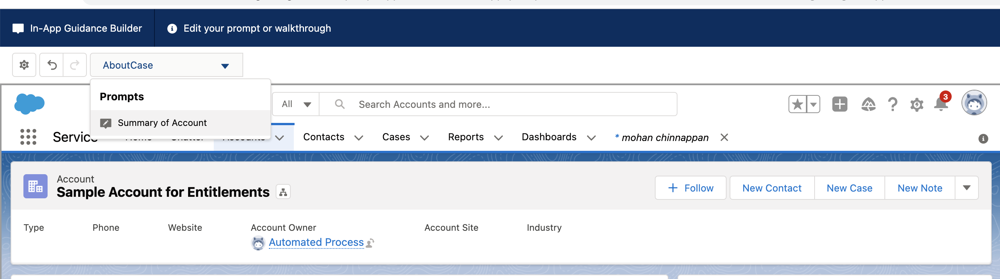
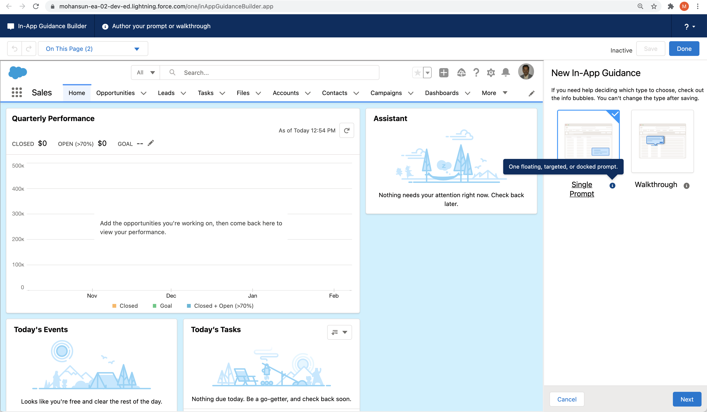
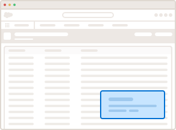
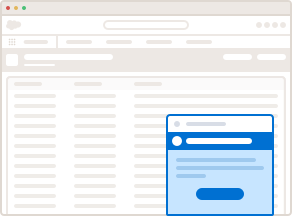
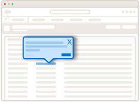
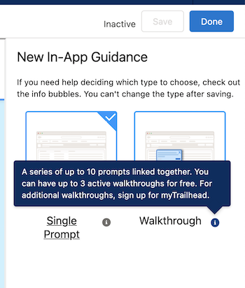

# In-App Guidance (IAG)
-  Add **prompts and walkthroughs** to your app to 
	- share information 
	- train, or onboard users 
- You can add multiple items to the same page, but they don’t appear at the same time
- 
- A  user sees only one item per 24 hours, per app by default
- Salesforce shows it **again** or **cancels scheduled recurrences** based on
	-  whether the user interacts with or ignores the prompt or walkthrough
# Increase user productivity 
- With Direct Guidance in Salesforce
- With Clicks
	- Let anyone  with right access create, prompts:
		- Single Step
		- Multi-Step (walkthroughs) 
	- for specific users

- Drive Users to Take Action
	- Deliver step-by-step content to users exactly where they need it to **train, communicate**, and more 
- Insights to track Engagement and enhance content
- Scalable
	- Local Language support
	- Pre-built solutions from AppExchange

# With Clicks, not Code
- Start
	- Select guidance and prompt types
- Create
	- Write the content
- Add an Action
	- Include an URL
- Schedule
	- Set a date and time to show
- Target
	- Specify the users for the target

# What is Unique about In-App Guidance 
- Users don’t need to install any browser extensions 
- No additional security reviews or approvals
- No performance impacts

- Less maintenance
- No code needed
- Managed by an admin (or In-App Guidance author)
- And it’s fully Reportable, Translatable, and Packageable

# Single Prompt
- 
## 3 Types
- Floating 
- Docked 
- Targeted 

# Floating Prompt 
- Stays in the position of your choice until user:
	- navigates away
	- takes action
	- closes it 
- 
	- *click on the image to run the demo*
# Docked  Prompt
- Stays in the bottom right, user can:
	- minimize or maximize 
	- close 
- 
	- *click on the image to run the demo*
# Targeted Prompt 
- Stays in the position of your choice until user: 
                - navigates away
                - takes action 
                - closes it
- 
	- *click on the image to run the demo*

# Walkthrough
- Series of up-to 10 prompts linked together
- With **Summer ‘21**, you can now activate up to **3** walkthroughs for free 
	- For additional walkthroughs, signup for **myTrailhead**
- 
	- *click on the image to run the demo* 
# In-App Walkthrough Licensing
- Bundled with myTrailhead
- With **Summer ‘21**, you can now activate up to **3** walkthroughs for free so you can kick the tires with full functionality.  
- 

# In-App Guidance Limits
- Prompts created in your org	: **500**
- Walkthroughs created in your org	: **500**
- Number of steps in a walkthrough: **10** floating, targeted, or docked prompts 

# References
- [Considerations for In-App Guidance in Lightning Experience](https://help.salesforce.com/s/articleView?id=sf.customhelp_lex_prompt_consider.htm&type=5)
