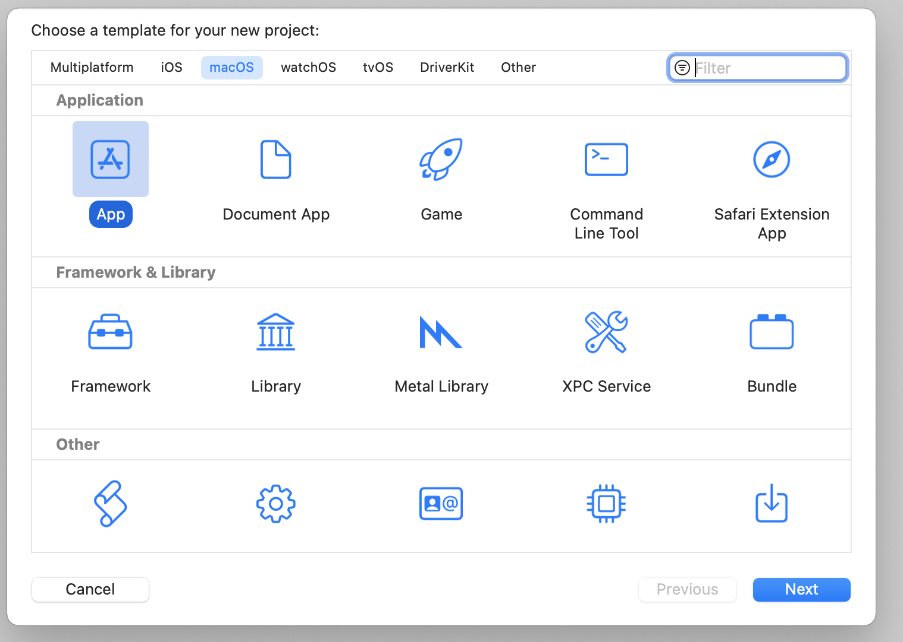
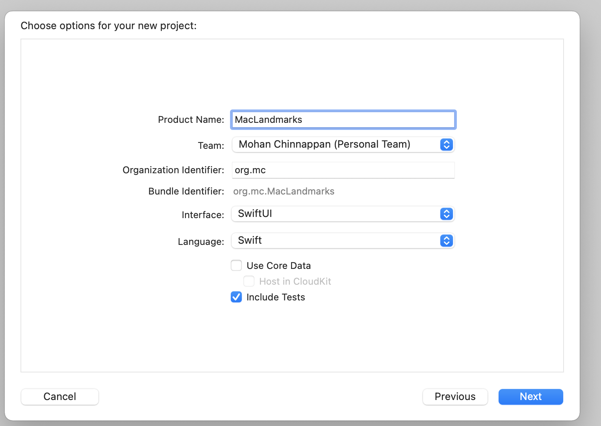
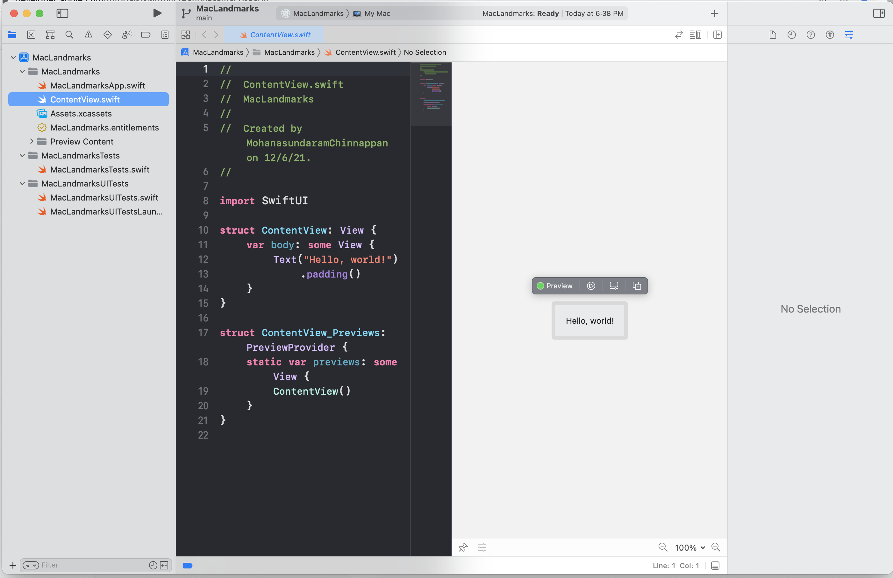

# Creating MacOS Application

- File > New > Target > [macOS] > App

- [Creating a macOS App](https://developer.apple.com/tutorials/swiftui/creating-a-macos-app)







## MacLandmarksApp.swift
```swift
import SwiftUI

@main
struct MacLandmarksApp: App {
    var body: some Scene {
        WindowGroup {
            ContentView()
        }
    }
}
```

## ContentView.swift

```swift
import SwiftUI

struct ContentView: View {
    var body: some View {
        Text("Hello, world!")
            .padding()
    }
}

struct ContentView_Previews: PreviewProvider {
    static var previews: some View {
        ContentView()
    }
}
```

# Creation

```bash
sfdx mohanc:slides:gen -i app.md -o app.md.html -t 'macOS App Development'
```


