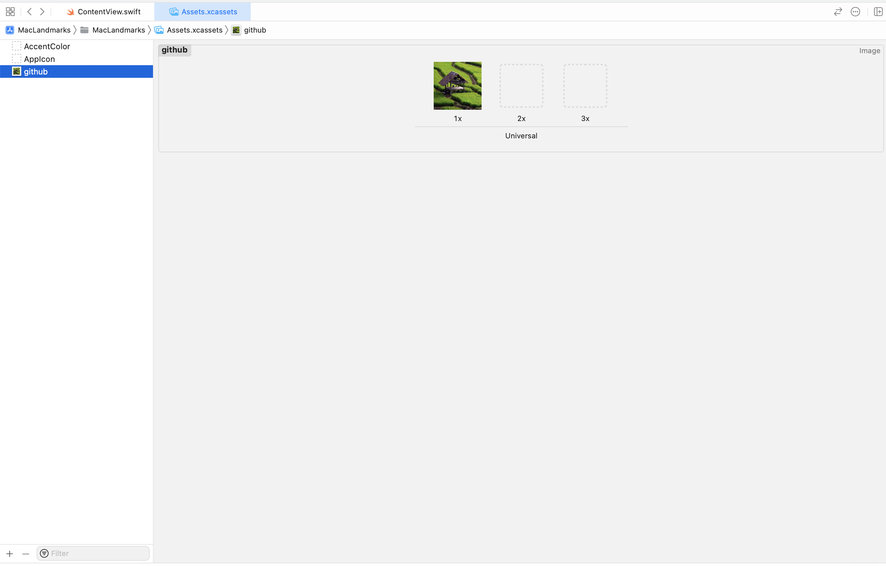
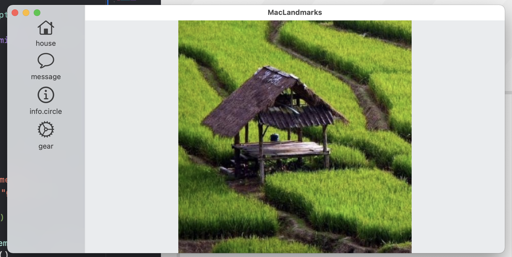
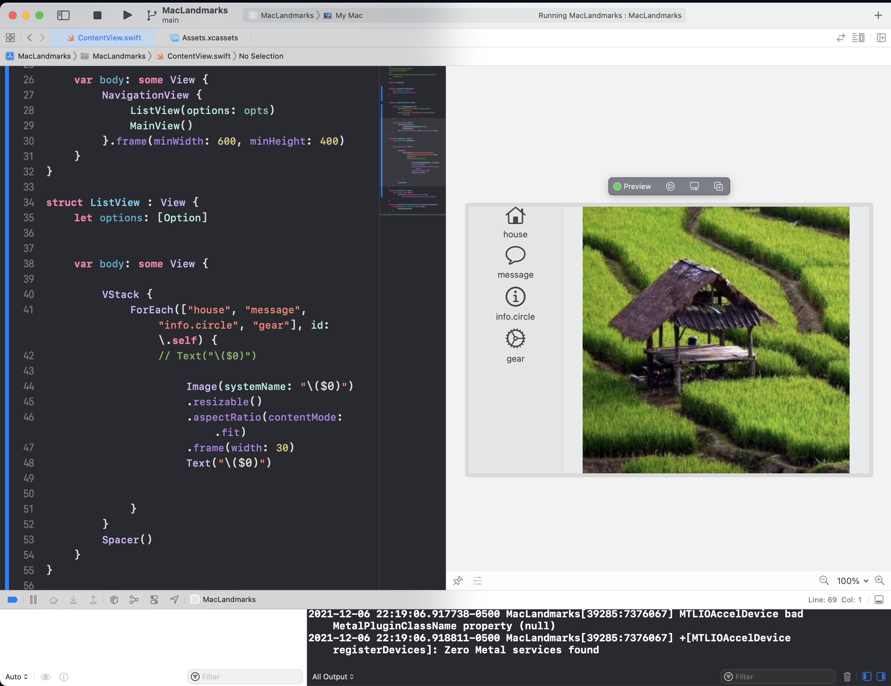

# Creating MacOS Application

- File > New > Target > [macOS] > App

- [Creating a macOS App](https://developer.apple.com/tutorials/swiftui/creating-a-macos-app)
- [SwiftUI: Build macOS App (2021, Xcode 12, SwiftUI 2) - macOS Development for Beginners](https://www.youtube.com/watch?v=6Qa-SspgRMM)


## MacLandmarksApp.swift
```swift
import SwiftUI

/*
An app that uses the SwiftUI app life cycle has a structure that conforms to the App protocol. The structure’s body property returns one or more scenes, which in turn provide content for display. 

The @main attribute identifies the app’s entry point

App > Scenes > View

*/

@main // App's entry point
struct MacLandmarksApp: App { // App protocol
    var body: some Scene { // returns Scenes
        WindowGroup {
            ContentView()
        }
    }
}
```

## ContentView.swift

```swift
import SwiftUI

// swift view

struct ContentView: View { // conforms to View Protocol
    var body: some View {
        Text("Hello, world!")
            .padding() // modifier
    }
}

struct ContentView_Previews: PreviewProvider {
    static var previews: some View {
        ContentView()
    }
}
```

# Adding Navigation View


```swift

import SwiftUI

struct ContentView: View {
    var body: some View {
        NavigationView {
            ListView()
            MainView()
        }.frame(minWidth: 600, minHeight: 400)
    }
}

struct ListView : View {
    var body: some View {
        Text("Left Menu View")
    }
}

struct MainView : View {
    var body: some View {
        Text("Right Content View")
    }
}

struct ContentView_Previews: PreviewProvider {
    static var previews: some View {
        ContentView()
    }
}
```


```swift
import SwiftUI


struct Option: Hashable {
    let title: String
    let imageName: String
}


struct ContentView: View {
    
    let opts : [Option] = [
        .init(title: "Home", imageName: "house"),
        .init(title: "Settings", imageName: "gear")

    ]
    
    var body: some View {
        NavigationView {
            ListView(options: opts)
            MainView()
        }.frame(minWidth: 600, minHeight: 400)
    }
}

struct ListView : View {
    let options: [Option]
         
    
    var body: some View {
    
        VStack {
            ForEach(["house", "message", "info.circle", "gear"], id: \.self) {
                // Text("\($0)")
                    Image(systemName: "\($0)")
                    .resizable()
                    .aspectRatio(contentMode: .fit)
                    .frame(width: 30)
                 
            }
        }
    }
}

struct MainView : View {
    var body: some View {
        Text("Right Content View")
    }
}

struct ContentView_Previews: PreviewProvider {
    static var previews: some View {
        ContentView()
    }
}

```






```swift
import SwiftUI


struct Option: Hashable {
    let title: String
    let imageName: String
}


struct ContentView: View {
    
    let opts : [Option] = [
        .init(title: "Home", imageName: "house"),
        .init(title: "Settings", imageName: "gear")

    ]
    
    var body: some View {
        NavigationView {
            ListView(options: opts)
            MainView()
        }.frame(minWidth: 600, minHeight: 400)
    }
}

struct ListView : View {
    let options: [Option]
         
    
    var body: some View {
    
        VStack {
            ForEach(["house", "message", "info.circle", "gear"], id: \.self) {
                // Text("\($0)")
                
                    Image(systemName: "\($0)")
                    .resizable()
                    .aspectRatio(contentMode: .fit)
                    .frame(width: 30)
                    Text("\($0)")
                
                 
            }
        }
        Spacer()
    }
}

struct MainView : View {
    var body: some View {
        Image("github").resizable()
            .aspectRatio(contentMode: .fit)
    }
}

struct ContentView_Previews: PreviewProvider {
    static var previews: some View {
        ContentView()
    }
}


```

# Creation

```bash
sfdx mohanc:slides:gen -i app.md -o app.md.html -t 'macOS App Development'
```


# The Open Scripting Architecture (OSA) 


- OSA provides a standard and extensible mechanism for inter-application communication in OS X. 
- This communication takes place through the exchange of **Apple events**. 
    - An Apple event is a type of inter-process message that **encapsulates commands and data**.

- **A scriptable application** 
    - responds to Apple events by **performing operations or supplying data**.
    - implements its own scripting features and exposes its own unique terminology through a **scripting dictionary**
- Any app with a graphical user interface responds to Apple Events at a minimal level. 
    -  OS X uses **Apple Events** to instruct all apps to perform core tasks such as 
        - launching, quitting, opening a document, and printing.

