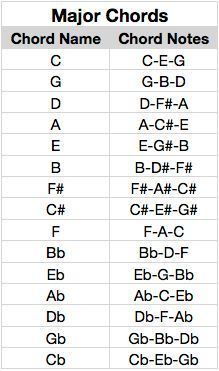

# Music notes

&#x2669; - quarter note

&#119134;

&#119134; 

&#x266A;

&#x266B;

&#x266C;

&#x266D;

&#x266E;

&#x266F;

&#x1D11E; -  G Clef

Refer:
[Unicodes for music block](https://unicode-table.com/en/blocks/musical-symbols/)

## Chords

[C Major chord songs](https://www.musikalessons.com/blog/2017/08/songs-in-c-major/)

## Score sheets
## AayiramMalargale (Tamil)

## MuseScore

[How to Separate and Join Note Beams in MuseScore 3, Cross Staff Beaming and Feathered Beaming
](https://youtu.be/l52sKkrOhaI)

