# Contributions

- Notes about our Ohana's  contribution to Art, Engineering and Medicine

# Introduction

- Key ingredients to the success of my Ohana  in the fields of Art, Engineering and Medication:
    - **Design Thinking**
    - Passionate about the field
    - Hard work and dedication

## Design Thinking
- I was able to influence my family folks to use Design Thinking principles in way of life
    - Medicine
        - Daughter received:
            - 2021 SAEM/RAMS Leadership Award 
            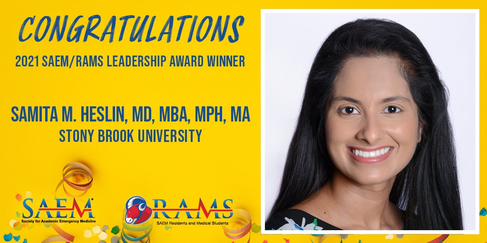

            - Academic Excellence Award
            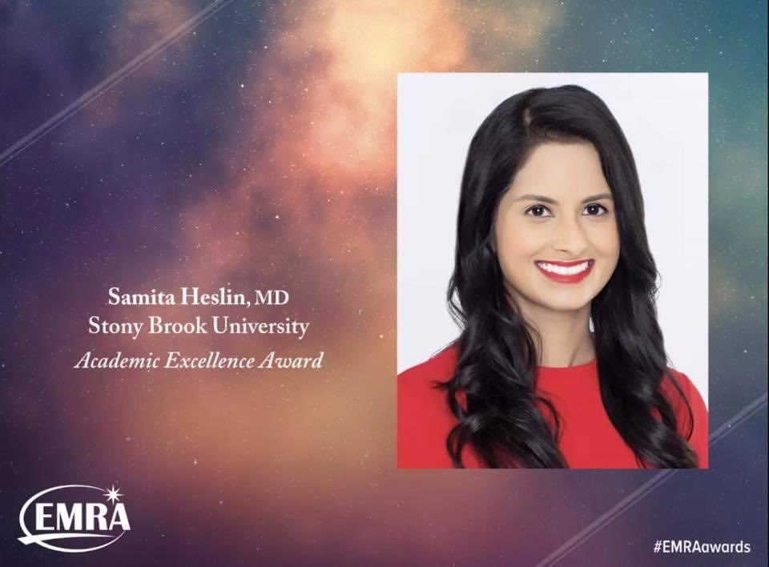

            - Design Thinking played vital role in Samita's projects

            -  implemented department-wide **telehealth iPad program**; designed and maintains a new department website; and created and ran innovative, interdisciplinary wellness initiatives for the residency program. Beyond this, 
            - teaches and mentors medical students, has published several peer-reviewed publications, and is a member of several hospital committees.
            ```
                - [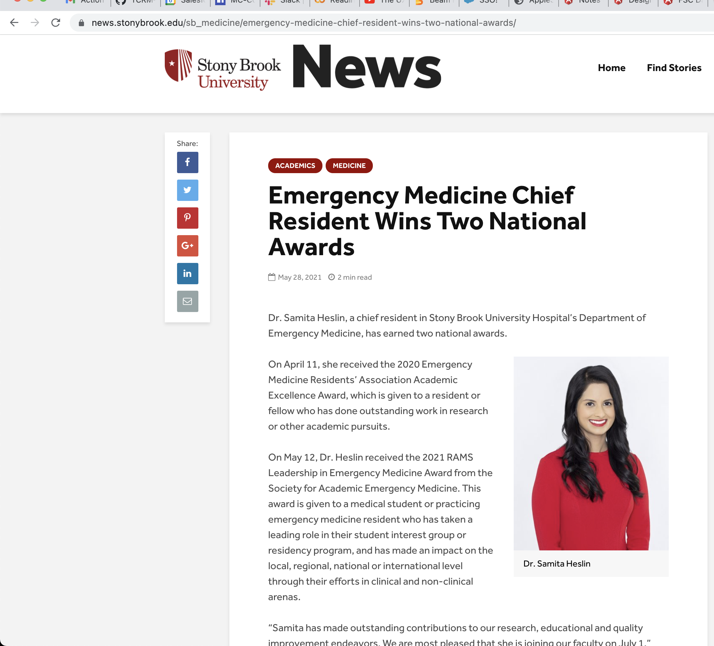](https://news.stonybrook.edu/sb_medicine/emergency-medicine-chief-resident-wins-two-national-awards/)


    - Art
        - Movie making
            - Latest movie produced by my family folks **Jai Bhim** is nominated for Gold Globes last week of November 2021
            - **Jai Bhim** has highest IMDB rating: 9.5
            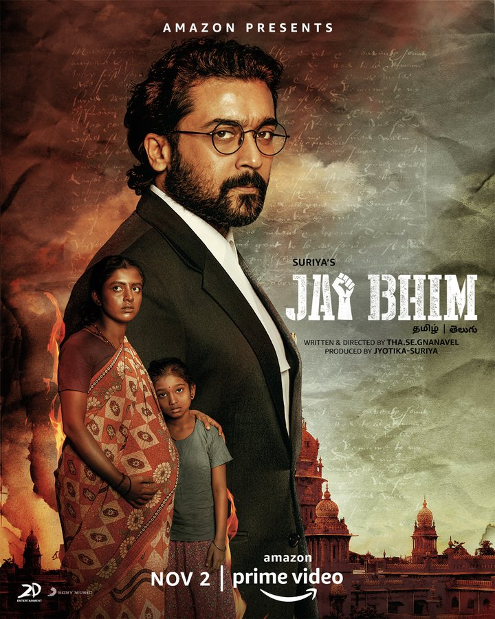
            - Many more to come in this area!
    - Engineering
        - Helped Semi-automatic Weaving machines (loom) to have a better safety mechanism
            - Protecting operators from shuttle fly-out incidents in loom
            
        - Helped in **Financial Service Cloud (FSC)** UI for discoverablity and feedback and created Interactive Data Model Application, which is used by many of FSC customers and consulting teams:
        [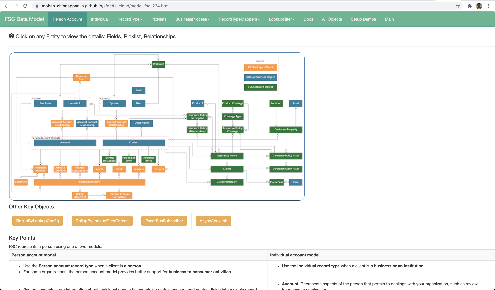](https://mohan-chinnappan-n.github.io/sfdc/fs-cloud/model-fsc-224.html)
        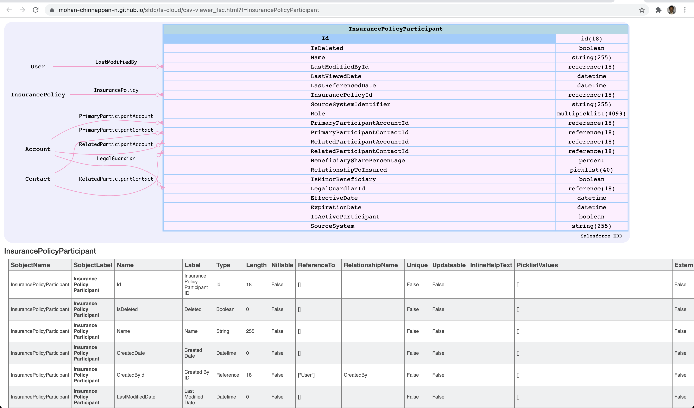
        - Helped in improving [Oracle WebCenter](https://www.oracle.com/middleware/technologies/webcenter.html) using Design Thinking principles.
        
        - Currently working on **IDA (Intelligent Document Automation)** for Apple Computers
            - [Apple - IDA - Current Work](https://mohan-chinnappan-n2.github.io/2021/automation/macos/ascripts.html?3#nav-keynote)
        


# Medicine

## Emergency Medicine

### Samita Mohan Heslin 

- 2021 SAEM/RAMS Leadership Award


- Academic Excellence Award


- Profile


# Art

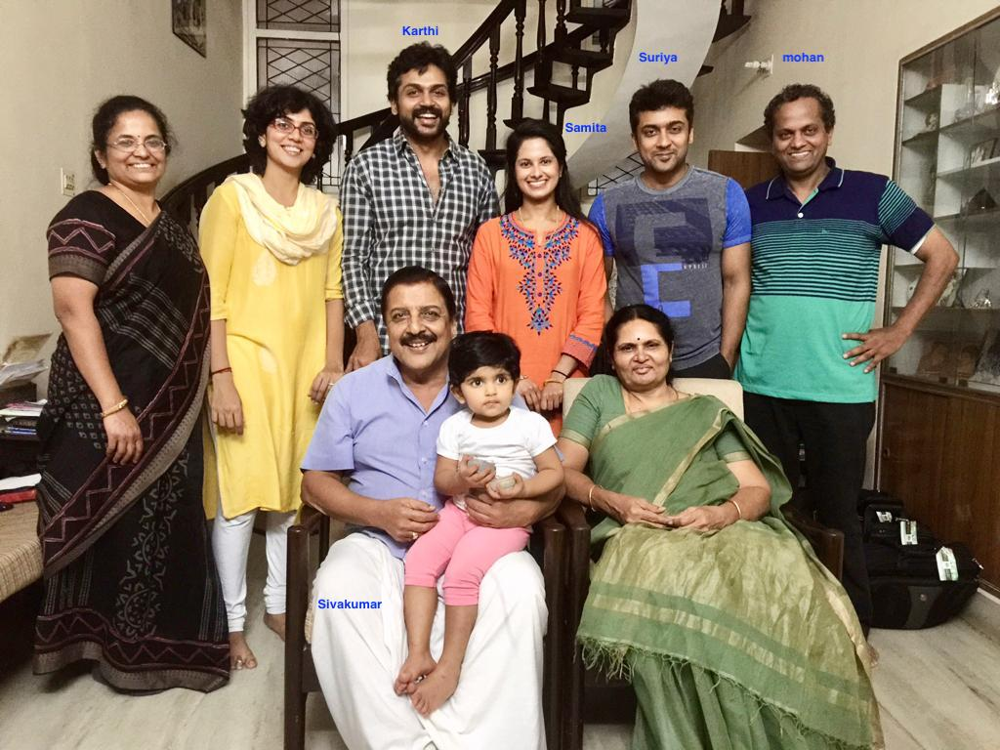


## Suriya

- [Wiki: Suriya](https://en.wikipedia.org/wiki/Suriya) 


## Jai Bhim (India)


### Awards
- [Golden Glob Awards nomination](https://www.goldenglobes.com/articles/jai-bhim-india)


### IMDB rating: 9.5
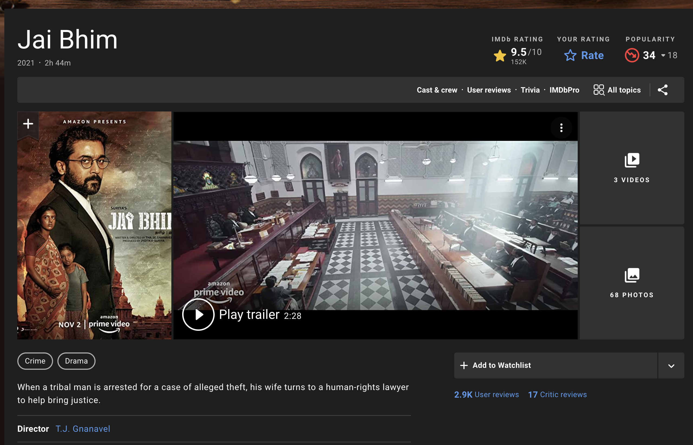

## Karthi

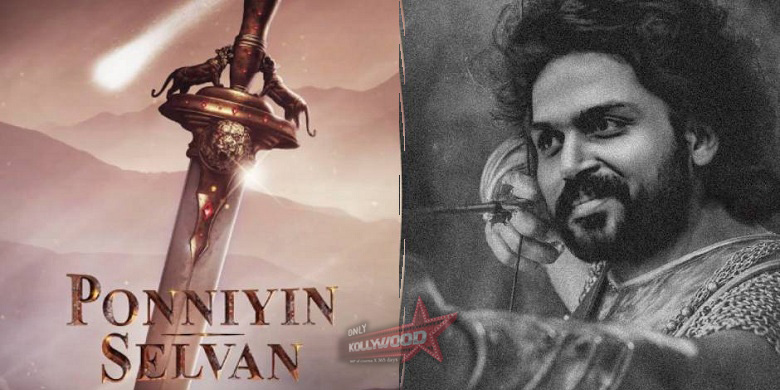

- [Wiki: Karthi](https://en.wikipedia.org/wiki/Karthi)

## Sivakumar
- [Wiki: Sivakumar](https://en.wikipedia.org/wiki/Sivakumar)

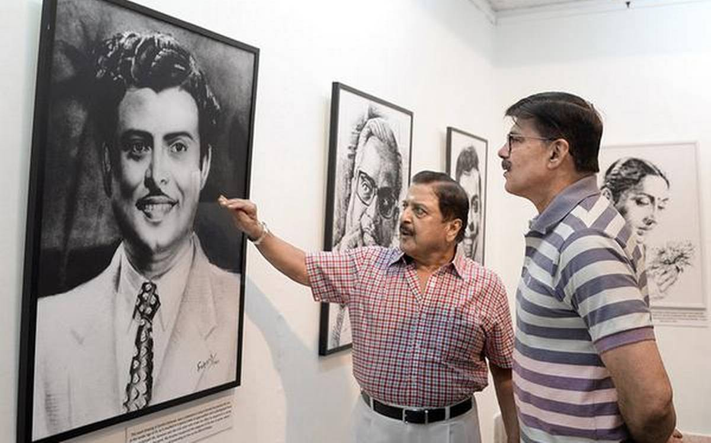
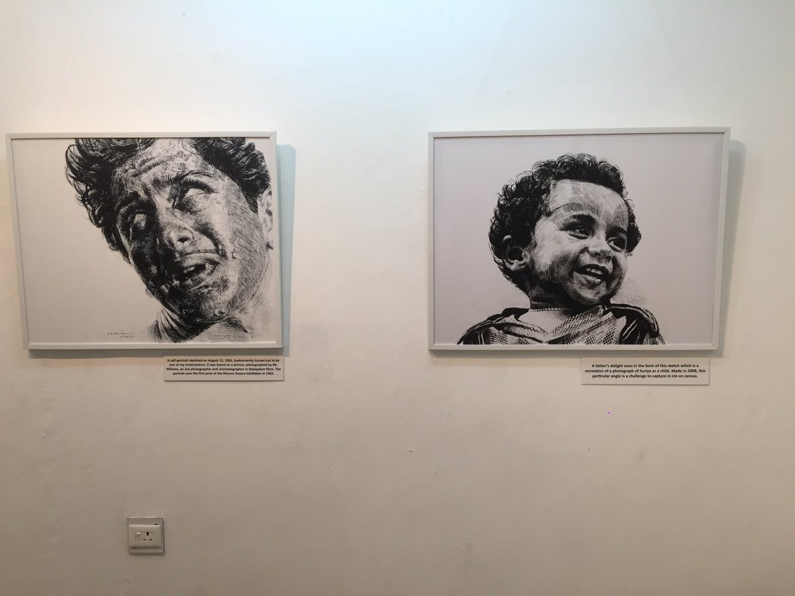


# Design, Engineering
- [Linux File Systems: MIT](https://esp.mit.edu/teach/teachers/mchinnappan/bio.html)
- [Database indexing](https://uspto.report/patent/app/20020083048)
- [Cloud Technologies](https://github.com/mohan-chinnappan-n/cli-dx)
- [Product development](https://www.salesforceblogger.com/2020/11/17/mohans-sfdx-plugin-for-analytics/)


- [About Mohan](https://mohan-chinnappan-n.github.io/about/cv.html)

- AI
    - [Contributor: TensorFlow](https://www.tensorflow.org/)

- Music
    - CDDB database design - [Gracenote](https://en.wikipedia.org/wiki/Gracenote)
    - [Meda apps](https://mohan-chinnappan-n2.github.io/media-app.html)
    

- Design 
[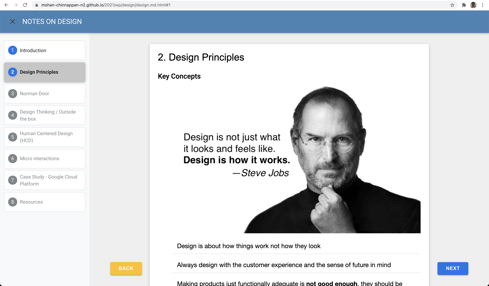](https://mohan-chinnappan-n2.github.io/2021/wp/design/design.md.html#0)

- Provided Design suggestions
    - [Oracle WebCenter](https://www.oracle.com/middleware/technologies/webcenter.html)
    - [Financial Services Cloud](https://mohan-chinnappan-n.github.io/sfdc/fs-cloud/model-fsc-224.html)
    - [Bosch GB-142](https://www.bosch-thermotechnology.us/us/media/country_pool/documents/download-buderus-products/buderus-manuals/6720820104_gb142_installation_instructions_en_10.2017.pdf)
    - [Google Cloud Platform: GCP](https://cloud.google.com/)

- Design Thinking
[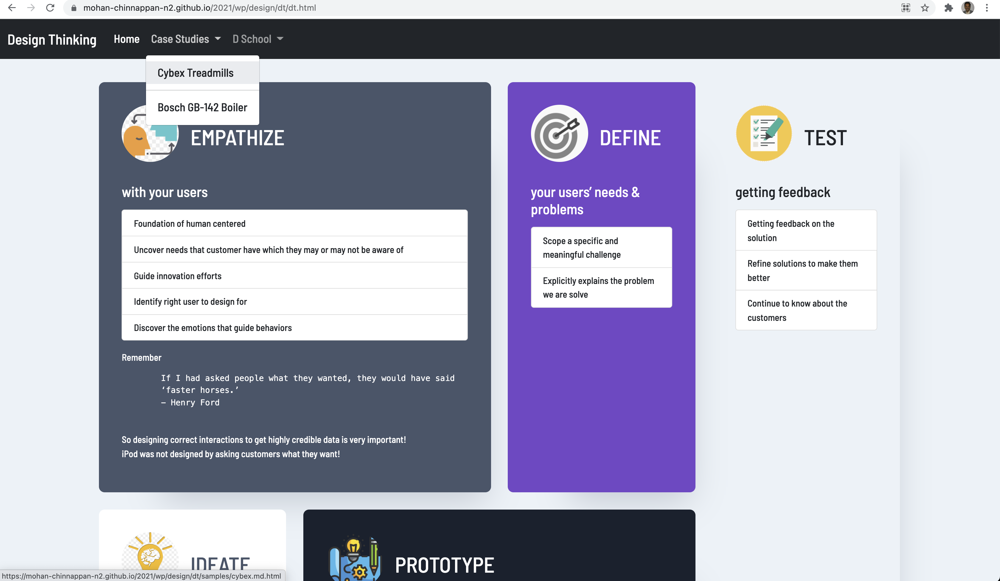](https://mohan-chinnappan-n2.github.io/2021/wp/design/dt/dt.html)

- 


# References
- [Github](https://github.com/mohan-chinnappan-n)

# Creation
- Script
```
sfdx mohanc:slides:gen -i ohana.md -o ohana.md.html -t 'ART, ENGINEERING AND MEDICINE'
```

