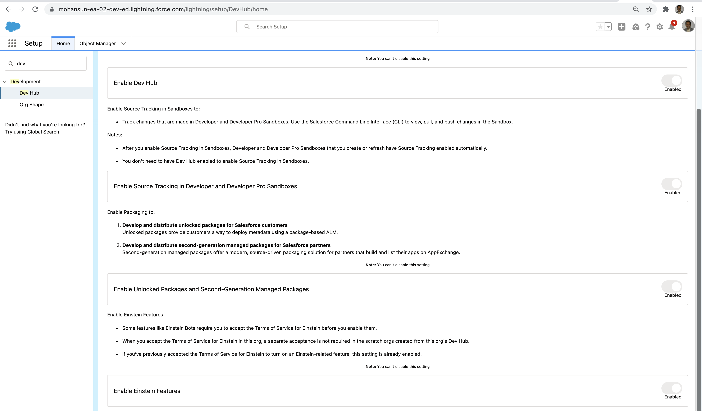

## Create SFDX project
```
sfdx force:project:create -n CalcProject
```
```
target dir = /Users/mchinnappan/sf-dev
   create CalcProject/config/project-scratch-def.json
   create CalcProject/README.md
   create CalcProject/sfdx-project.json
   create CalcProject/.husky/pre-commit
   create CalcProject/.vscode/extensions.json
   create CalcProject/.vscode/launch.json
   create CalcProject/.vscode/settings.json
   create CalcProject/force-app/main/default/lwc/.eslintrc.json
   create CalcProject/force-app/main/default/aura/.eslintrc.json
   create CalcProject/scripts/soql/account.soql
   create CalcProject/scripts/apex/hello.apex
   create CalcProject/.eslintignore
   create CalcProject/.forceignore
   create CalcProject/.gitignore
   create CalcProject/.prettierignore
   create CalcProject/.prettierrc
   create CalcProject/jest.config.js
   create CalcProject/package.json


```

## Enable a Dev Hub



## Login
```
sf login
? What would you like to log into? Salesforce Org
? Set an alias for the org (leave blank for no alias) sforg
? Set the org as your default org? target-dev-hub, target-org
You're now logged in to mohan.chinnappan.n_ea2@gmail.com.


```

```
sf login functions

```


