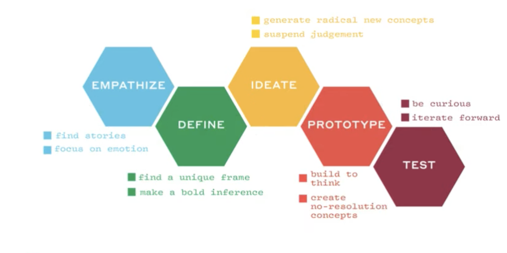

# Design Thinking

- Idea generation methodology 

## Goals
- Coming with ideas and verifying that they are good!
- Make tools, mindsets, ways-of-thinkings and frameworks that helped designers to solve problems **available to** to all

### Problems examples
- Introducing new products or applications to the market
- Crafting Sales Pitch

### Design Thinking Process

- Empathize
    - get to know the users
    - understand their feelings and emotions
- Define
    - the problem to be solved
    - what problem matters to the users
- Ideate
    - generate set of potential solutions
- Prototype
- Test

- Implement and redefine and discover which ideas worked 

## Stanford Design School
- Intersection of Art of Engineering
- More than a simple process it is :
    - way of being
    - acting 
    - interacting
- Tools and frameworks to help us to: 
    - focus on human behavior is adopting to those changes
    - allow to look at those changes optimistically 

## References
- [Webinar - Design Thinking: What is it and why should I care?](https://www.youtube.com/watch?v=GeUXQ_L-35M)