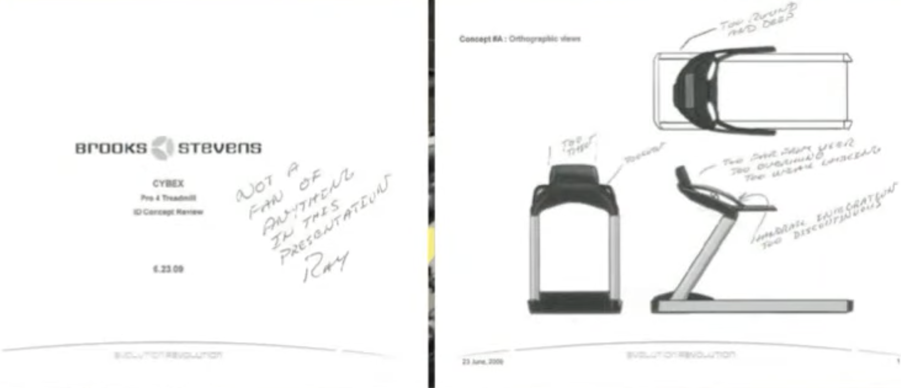
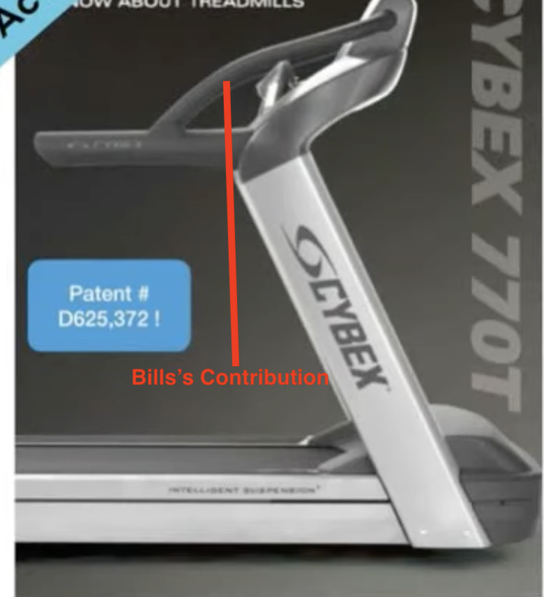

# Cybex - Treadmills

## Obstacle  (O in V2MOM)
- Bill Pacheco's Manager did not find the need for this value add

## Competitors
- TechnoGym
- LiftFitness
- PRECOR
- STAR TRAC
- TRUE

# Stages
- Bill Pacheco (Sr. Director Cybex, Keurig Dr. Pepper) used Empathy
    - talk to folks in the gym
    - asking open ended questions
    - leave yourself to questions
    - understand the emotions of the user
    - was not a data collection - how long they were on a tread mill
    - was looking at the faces of the users
    - noticed
        - users were afraid on these gym machines (EMPATHY)
        - close proximity to the users
    - suggested
        - changing the structure around these gym products
    - current mindset
        - these products are all matured
        - Bill is supposed work on adding new features
    - Bill started working on quick drawings about:
        - How to remove the fear the users have
            - may be giving more places in the products the users can hold on to
            - quick prototype with PVC pipes (IDEATION)
            
            - Bill's Manager's feedback was not great! Bill believed in it
                - went on and made better and rough prototype to validate his ideas
                - put that prototype in use with the users (TEST)
                - took this to a hotel gym and measured how many users preferred his prototype (VALIDATION) 
                - used this data to put this modified product into market
                - got 20% growth in 2 years in a row!
                - Bill solved fear problem - real human need - better product
                

            
