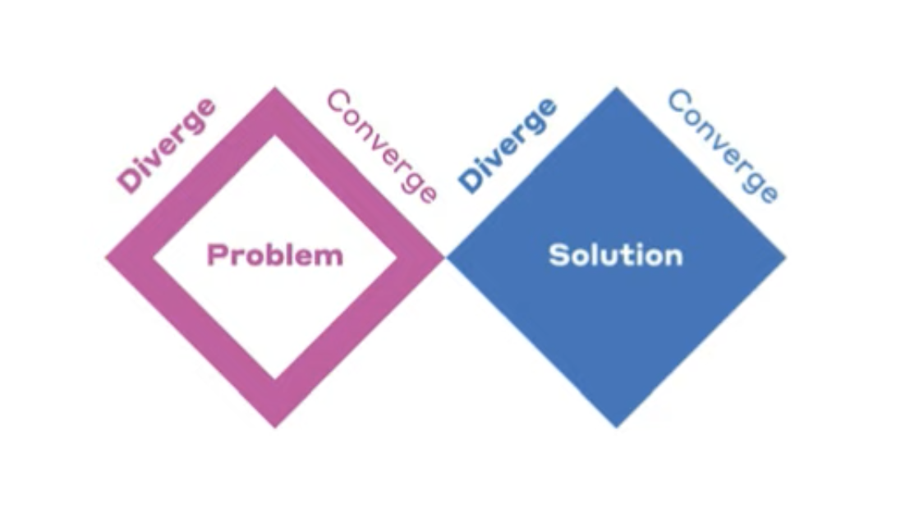
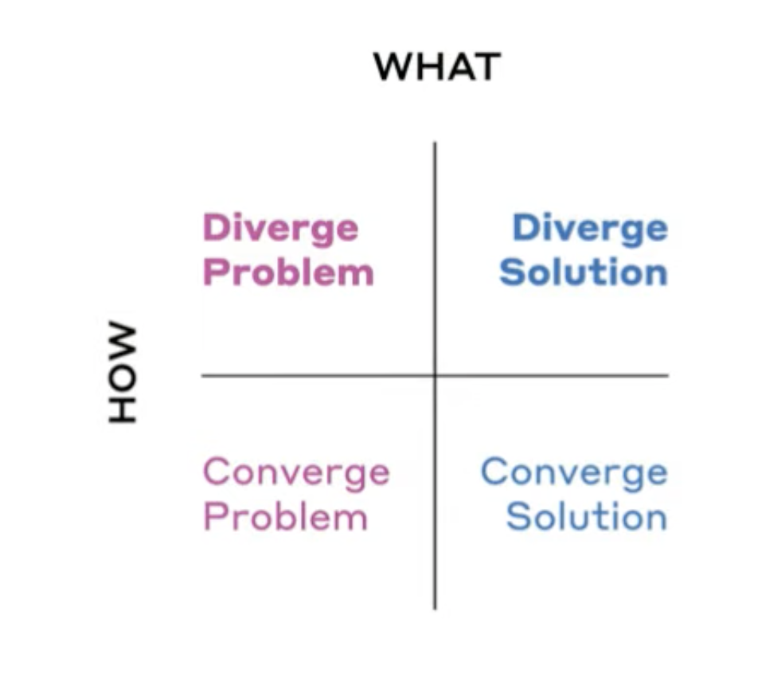

# Design thinking
- Advance on conventional problem solving

## Conventional Problem Solving
- Manager says **Implement this solution**
- Hand you a grain of sand
- Idea on a PostIt
- Do this!

## Design thinking way
- Hang on
- Before we converge on this one solution
    - Let us diverge and generated as many ideas as possible to solve the problem
    - **DIVERGE before we CONVERGE**
- There are 2 pieces in any **problem solving** endeavor - *instead of just thinking about the solution to the problem*
    - Problem finding 
        - Generate possible potential problems
        

### Make sure problem and solution overlap well
- 

- makes efforts to assess the fit - problem and solution 

- 

## References
- [Stanford D School - Webinar - Design Thinking: What is it and why should I care?](https://www.youtube.com/watch?v=GeUXQ_L-35M)
